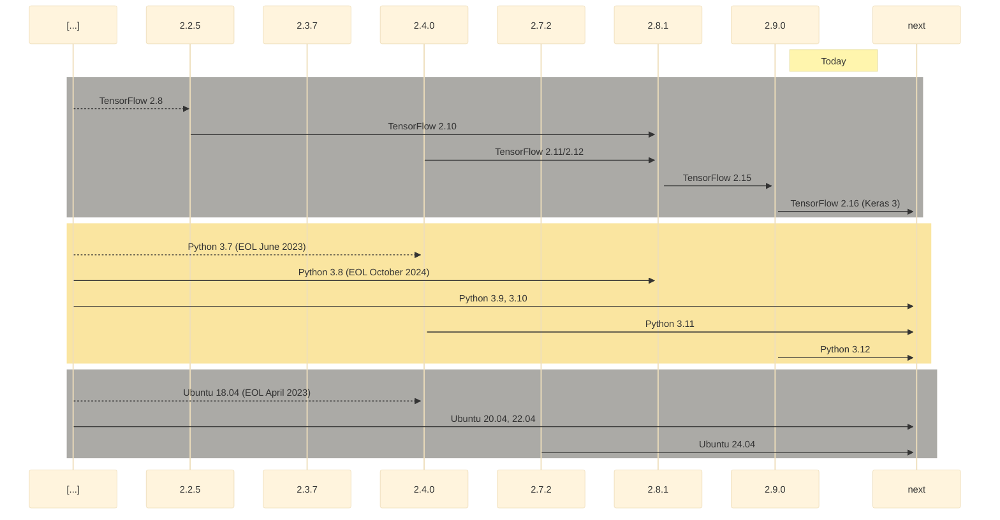

# Online documentation
Please refer to the [online documentation](https://doc.brainchipinc.com/) for
installation steps, user guides and APIs.

# Building the documentation
Documentation is based on [Sphinx](https://www.sphinx-doc.org/en/master/) and
can be generated locally from the repository top.

## Requirements:
* Python version: python >= 3.9
* TensorFlow version ~= 2.15
* Sphinx version 2.1 or above

## Build steps
* *Optional*: create a virtual environment using
[Virtualenv](https://virtualenv.pypa.io/en/latest/) or
[Conda](https://docs.conda.io/en/latest/)

* Install akida packages and their requirements using the provided file:
~~~~
pip install -r requirements.txt
~~~~

* Install Sphinx additional modules used by the documentation:
~~~~
pip install sphinx_rtd_theme sphinx-gallery autodocsumm sphinx_design
~~~~

* Finally build using *sphinx-build* tool, refer to
[Sphinx tutorial](https://matplotlib.org/sampledoc/) for details on this command
line:
~~~~
sphinx-build -D plot_gallery=0 -b html ./doc ./build
~~~~

Note that by removing the *-D plot_gallery=0* option in the previous command,
examples will be executed for a nicer rendering but it will take much more time.
If needed (e.g. for debugging), a set of selected examples can be rendered through the command:
~~~~
sphinx-build -b html ./doc ./build -D sphinx_gallery_conf.filename_pattern=regex_my_examples.py
~~~~

* Open *.build/index.html* once done

## Style check

Style check is based on [flake8](https://flake8.pycqa.org/en/latest/).

To align examples with python formatting rules:

```
autopep8 --ignore E402,E501 --in-place --recursive examples/
```

## Supported versions history
Versions are akida/cnn2snn packages ones. Please refer to https://github.com/Brainchip-Inc/akida_examples/releases for more details.


