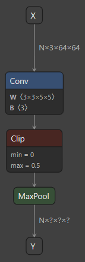

.. DO NOT EDIT.
.. THIS FILE WAS AUTOMATICALLY GENERATED BY SPHINX-GALLERY.
.. TO MAKE CHANGES, EDIT THE SOURCE PYTHON FILE:
.. "examples/quantization/plot_3_custom_patterns.py"
.. LINE NUMBERS ARE GIVEN BELOW.

.. only:: html

    .. note::
        :class: sphx-glr-download-link-note

        :ref:`Go to the end <sphx_glr_download_examples_quantization_plot_3_custom_patterns.py>`
        to download the full example code.

.. rst-class:: sphx-glr-example-title

.. _sphx_glr_examples_quantization_plot_3_custom_patterns.py:

Advanced ONNX models quantization
=================================

Akida, like any specialized hardware accelerator, sacrifices very generalized computational
ability in favor of highly optimized implementations of a subset of key operations. While
we strive to make sure that Akida directly supports the most important models, it isn't
feasible to support all possibilities. You may thus occasionally find yourself with a
model which is very nearly compatible with Akida, but which fails to convert due to just
a few incompatibilities. In this example, we will look at some simple workarounds and how
to implement them. The goal is to successfully convert the model to Akida without having
to retrain.

Preparing a model for Akida requires two steps: quantization, followed by conversion
for a specific target hardware device. We try to catch as many incompatibilities as
possible at the quantization step. However, some constraints depend on the specific
target device, and can only be caught at the conversion step. To illustrate, we will
simply walk through the process of preparing `MobileNetV4 <https://arxiv.org/abs/2404.10518>`__ for
acceleration on Akida - we'll run into several incompatibilities at different points
in that process, and see how to resolve them.

This example assumes a moderate level of experience with deep learning, and good familiarity
with the operations typically encountered in these types of models. For example, here we'll
use the following workarounds:

* to avoid an incompatible padding scheme in convolution, we will overwrite paddings values when
  not aligned with Akida expectations,
* in order to handle an unsupported kernel-size 5/stride 2 depthwise convolution, we'll split that
  into two equivalent operations: a kernel-size 5 depthwise convolution using the same weights, but
  with stride 1; followed by a kernel-size 3/stride 2 depthwise convolution with identity weights.

.. Note::
   | This tutorial leverages the `Optimum toolkit
     <https://huggingface.co/docs/optimum/main/en/exporters/onnx/usage_guides/export_a_model>`__,
     an external tool, based on `PyTorch <https://pytorch.org/>`__, that allows models direct
     download and export to ONNX.

     .. code-block::

        pip install optimum[exporters]

.. GENERATED FROM PYTHON SOURCE LINES 44-48

1. Get model and data
---------------------
Before diving into the model incompatibilities and how to resolve them, we'll need to acquire
some sample data to test on, plus the pretrained model.

.. GENERATED FROM PYTHON SOURCE LINES 50-59

1.1 Data
^^^^^^^^

Given that the reference model was trained on `ImageNet <https://www.image-net.org/>`__ dataset
(which is not publicly available), this tutorial uses a set of 10 copyright free images.
A helper function ``imagenet.preprocessing.get_preprocessed_samples`` loads
and preprocesses (decodes, crops and extracts a square 224x224x3 patch from an input image)
these images.

.. GENERATED FROM PYTHON SOURCE LINES 59-83

.. code-block:: Python

    import numpy as np

    from akida_models.imagenet import get_preprocessed_samples
    from akida_models.imagenet.imagenet_utils import IMAGENET_MEAN, IMAGENET_STD

    # Model specification and hyperparameters
    NUM_CHANNELS = 3
    IMAGE_SIZE = 224

    # Load the preprocessed images and their corresponding labels for the test set
    x_test_raw, labels_test = get_preprocessed_samples(IMAGE_SIZE, NUM_CHANNELS)
    num_images = x_test_raw.shape[0]

    # Normalize images as models expects
    imagenet_mean_255 = np.array(IMAGENET_MEAN, dtype="float32") * 255.0
    imagenet_std_255 = np.array(IMAGENET_STD, dtype="float32") * 255.0
    x_test = ((x_test_raw - imagenet_mean_255) / imagenet_std_255)

    # Transpose the channels to the first axis as per the default for ONNX models
    x_test = np.transpose(x_test, (0, 3, 1, 2))

    print(f'{num_images} images and their labels are loaded and preprocessed.')

.. rst-class:: sphx-glr-script-out

 .. code-block:: none

    10 images and their labels are loaded and preprocessed.

.. GENERATED FROM PYTHON SOURCE LINES 84-90

1.2 Download the model
^^^^^^^^^^^^^^^^^^^^^^

We download MobileNetV4 small from the `HuggingFace hub
<https://huggingface.co/timm/mobilenetv4_conv_small.e2400_r224_in1k>`_.

.. GENERATED FROM PYTHON SOURCE LINES 90-101

.. code-block:: Python

    import onnx
    from optimum.exporters.onnx import main_export

    # Download and convert MobiletNetV4 to ONNX
    main_export(model_name_or_path="timm/mobilenetv4_conv_small.e2400_r224_in1k",
                task="image-classification", output="./")

    # Load the model in memory
    onnx_model = onnx.load_model("./model.onnx")

.. GENERATED FROM PYTHON SOURCE LINES 102-113

1.3 Evaluate model performance
^^^^^^^^^^^^^^^^^^^^^^^^^^^^^^

The `ONNXRuntime <https://onnxruntime.ai>`__ package is a cross-platform
accelerator capable of loading and running models described in ONNX format.
We use this framework to evaluate the performance of the loaded ResNet50
model.

.. Note:: For example purposes, we only compute accuracy on 10 images.
   Accuracy on the full ImageNet validation set is reported at the end.

.. GENERATED FROM PYTHON SOURCE LINES 113-131

.. code-block:: Python

    from onnxruntime import InferenceSession

    def evaluate_onnx_model(model):
        sess = InferenceSession(model.SerializeToString())
        # Calculate outputs by running images through the session
        outputs = sess.run(None, {model.graph.input[0].name: x_test})
        # The class with the highest score is what we choose as prediction
        predicted = np.squeeze(np.argmax(outputs[0], 1))
        # Compute the number of valid predictions
        return int((predicted == labels_test).sum())

    # Evaluate over test dataset
    correctly_classified_floating = evaluate_onnx_model(onnx_model)
    print(f'Floating point model accuracy: {correctly_classified_floating}/{num_images}.')

.. rst-class:: sphx-glr-script-out

 .. code-block:: none

    Floating point model accuracy: 9/10.

.. GENERATED FROM PYTHON SOURCE LINES 132-147

2. Quantize
-----------

Akida processes integer inputs, activations and weights. Therefore, the first step in
preparing a floating point model to run on Akida is to quantize it using `QuantizeML quantize()
<../../api_reference/quantizeml_apis.html#quantizeml.models.quantize>`__.

.. Note::
  Please refer to the `QuantizeML toolkit user guide <../../user_guide/quantizeml.html>`__
  and the `Advanced QuantizeML tutorial <./plot_0_advanced_quantizeml.html>`__ for further details.
  In particular here, for simplicity, we pass only the small number of samples we already prepared
  for calibration. Typically, you will want to use many more samples for calibration, say 1000 if
  you have them available; and not drawn from your test data. The akida_models package provides a
  helper function, `extract_samples() <../../api_reference/akida_models_apis.html#extract-samples>`__
  which may be helpful in preparing those.

.. GENERATED FROM PYTHON SOURCE LINES 147-152

.. code-block:: Python

    from quantizeml.models import quantize

    model_quantized = quantize(onnx_model, samples=x_test)

.. rst-class:: sphx-glr-script-out

 .. code-block:: none


    Calibrating with 10/10.0 samples

.. GENERATED FROM PYTHON SOURCE LINES 153-154

The model was quantized successfully, we can check its accuracy:

.. GENERATED FROM PYTHON SOURCE LINES 154-158

.. code-block:: Python

    correctly_classified = evaluate_onnx_model(model_quantized)
    print(f'Quantized model accuracy: {correctly_classified}/{num_images}.')

.. rst-class:: sphx-glr-script-out

 .. code-block:: none

    Quantized model accuracy: 9/10.

.. GENERATED FROM PYTHON SOURCE LINES 159-161

3. Conversion
-------------

.. GENERATED FROM PYTHON SOURCE LINES 163-172

3.1. Incompatibility at Conversion
^^^^^^^^^^^^^^^^^^^^^^^^^^^^^^^^^^

While most imcompatibilities will be picked up at the quantization step, some constraints are
specific to the target hardware device, and can only be applied at the conversion step. We can
detect these either with the `check_model_compatibility
<../../api_reference/cnn2snn_apis.html#cnn2snn.check_model_compatibility>`__ tool,
or by trying to `convert the model into Akida
<../../api_reference/cnn2snn_apis.html#cnn2snn.convert>`__.

.. GENERATED FROM PYTHON SOURCE LINES 172-180

.. code-block:: Python

    from cnn2snn import convert

    try:
        akida_model = convert(model_quantized)
    except Exception as e:
        print(f"MobileNetV4 is not fully accelerated by Akida. Reason: {str(e)}")

.. rst-class:: sphx-glr-script-out

 .. code-block:: none

    MobileNetV4 is not fully accelerated by Akida. Reason: Cannot convert /conv_stem/Conv: Expect pads [0, 0, 1, 1] (found [1, 1, 1, 1]) in /conv_stem/Conv.

.. GENERATED FROM PYTHON SOURCE LINES 181-193

This error is raised because the MobileNetV4 padding scheme is specific and differs from the
TF-Keras/Akida standard.

Ideally, we should aim to swap incompatible operations with mathematically
equivalent replacements. For issues of convolution kernel size or padding, we can
often achieve that by putting the kernel weights within a larger kernel, placed
eccentrically to compensate for any padding issues etc. In this case, we'll
try simply modifying the padding to be Akida-compatible.

To achieve this, we'll define custom quantization pattern to modify the model before
quantization. Rather than try to provide a general solution, we'll hard code this for
the problem layers.

.. GENERATED FROM PYTHON SOURCE LINES 195-233

3.2. About Patterns
^^^^^^^^^^^^^^^^^^^

For efficiency, Akida hardware actually groups certain commonly occuring
operations together. For example, ReLU activation functions, where present,
are almost always applied on the outputs of the hard-working computational
layers (Convolutions, Depthwise Convolutions, Dense layers etc.). So the ReLU
on Akida is tied to those operations. While efficient, this does mean that
some sequences of operations will not by default be considered Akida-compatible,
even though the individual operations are known to be handled. That's the
cause of the problem encountered here.

To properly see what's going on, and to resolve the problem, we'll need to
understand the concept of "patterns". These are the objects that QuantizeML
uses to map ONNX models to their Akida equivalents. A pattern is a sequence of
continuous `ONNX operators <https://onnx.ai/onnx/operators/>`_ in a graph that
**can be converted** to an
`Akida V2 layer <../../api_reference/akida_apis.html#akida-v2-layers>`_.
For example, the following model would be converted to an `akida.InputConv2D
<../../api_reference/akida_apis.html#akida.InputConv2D>`_ layer:

   One ONNX configuration that would map to an `InputConv2D
   <../../api_reference/akida_apis.html#akida.InputConv2D>`_.

The sequence of operators [``Conv``, ``Clip``, ``MaxPool``] **is one valid pattern**
for conversion towards `InputConv2D <../../api_reference/akida_apis.html#akida.InputConv2D>`_.

Crucially, we can check the list of the currently supported patterns:

.. GENERATED FROM PYTHON SOURCE LINES 233-238

.. code-block:: Python

    from quantizeml.onnx_support.quantization.register_patterns import PATTERNS_MAP

    print(*PATTERNS_MAP, sep='\n')

.. rst-class:: sphx-glr-script-out

 .. code-block:: none

    QuantizerPattern(pattern=('Conv', 'Relu', 'GlobalAveragePool'), f=[<function get_qconv at 0x7145762b1a80>])
    QuantizerPattern(pattern=('Conv', 'MaxPool', 'Relu'), f=[<function get_qconv at 0x7145762b1a80>])
    QuantizerPattern(pattern=('Conv', 'GlobalAveragePool'), f=[<function get_qconv at 0x7145762b1a80>])
    QuantizerPattern(pattern=('Conv', 'Relu'), f=[<function get_qdepthwise at 0x7145762b2c00>, <function get_qconv at 0x7145762b1a80>])
    QuantizerPattern(pattern=('Conv', 'Clip', 'GlobalAveragePool'), f=[<function get_qconv at 0x7145762b1a80>])
    QuantizerPattern(pattern=('Conv', 'MaxPool', 'Clip'), f=[<function get_qconv at 0x7145762b1a80>])
    QuantizerPattern(pattern=('Conv', 'activation', 'GlobalAveragePool'), f=[<function get_qconv at 0x7145762b1a80>])
    QuantizerPattern(pattern=('Conv', 'Clip'), f=[<function get_qdepthwise at 0x7145762b2c00>, <function get_qconv at 0x7145762b1a80>])
    QuantizerPattern(pattern=('Conv', 'activation'), f=[<function get_qdepthwise at 0x7145762b2c00>, <function get_qconv at 0x7145762b1a80>])
    QuantizerPattern(pattern=('Conv',), f=[<function get_qdepthwise at 0x7145762b2c00>, <function get_qconv at 0x7145762b1a80>])
    QuantizerPattern(pattern=('Flatten', 'Gemm', 'Relu'), f=[<function get_qgemm at 0x7145762b2d40>])
    QuantizerPattern(pattern=('Flatten', 'Gemm', 'Clip'), f=[<function get_qgemm at 0x7145762b2d40>])
    QuantizerPattern(pattern=('Flatten', 'Gemm'), f=[<function get_qgemm at 0x7145762b2d40>])
    QuantizerPattern(pattern=('Gemm', 'Relu'), f=[<function get_qgemm at 0x7145762b2d40>])
    QuantizerPattern(pattern=('Gemm', 'Clip'), f=[<function get_qgemm at 0x7145762b2d40>])
    QuantizerPattern(pattern=('Gemm',), f=[<function get_qgemm at 0x7145762b2d40>])
    QuantizerPattern(pattern=('Add', 'Relu'), f=[<function get_qadd at 0x7145762b3420>])
    QuantizerPattern(pattern=('Add',), f=[<function get_qadd at 0x7145762b3420>])
    QuantizerPattern(pattern=('Concat',), f=[<function get_qconcat at 0x7145762b34c0>])
    QuantizerPattern(pattern=('ConvTranspose', 'Clip'), f=[<function get_qconv_transpose at 0x7145762b2200>])
    QuantizerPattern(pattern=('ConvTranspose', 'Relu'), f=[<function get_qconv_transpose at 0x7145762b2200>])
    QuantizerPattern(pattern=('ConvTranspose', 'activation'), f=[<function get_qconv_transpose at 0x7145762b2200>])
    QuantizerPattern(pattern=('ConvTranspose',), f=[<function get_qconv_transpose at 0x7145762b2200>])
    QuantizerPattern(pattern=('Transpose', 'Mul', 'Add'), f=[<function get_input_quantizer at 0x7145762971a0>])
    QuantizerPattern(pattern=('Transpose', 'Mul'), f=[<function get_input_quantizer at 0x7145762971a0>])
    QuantizerPattern(pattern=('Mul', 'Add'), f=[<function get_input_quantizer at 0x7145762971a0>])
    QuantizerPattern(pattern=('Mul',), f=[<function get_input_quantizer at 0x7145762971a0>])
    QuantizerPattern(pattern=('BufferTempConv', 'Relu'), f=[<function get_qbtc at 0x7145762ff4c0>])
    QuantizerPattern(pattern=('DepthwiseBufferTempConv', 'Relu'), f=[<function get_qdbtc at 0x7145762ff560>])
    QuantizerPattern(pattern=('BufferTempConv',), f=[<function get_qbtc at 0x7145762ff4c0>])
    QuantizerPattern(pattern=('DepthwiseBufferTempConv',), f=[<function get_qdbtc at 0x7145762ff560>])

.. GENERATED FROM PYTHON SOURCE LINES 239-252

.. Note::
  Before the conversion the following changes are automatically done to allow the
  QuantizeML toolkit to see an ONNX graph suitable for quantization:

      1. transforms the following operators for general purposes:

         * ``Conv`` -> ``DepthwiseConv`` when kernel size is 1 x Kx x Ky and ``group`` is required
         * ``Clip`` > ``Relu`` (if ``min = 0.0``)

      2. uses `Graph Optimizations in ONNX Runtime
         <https://onnxruntime.ai/docs/performance/model-optimizations/graph-optimizations.html>`_
         to optimize the graph (e.g. fuse BatchNorm into convolutions).

.. GENERATED FROM PYTHON SOURCE LINES 255-271

3.3. Custom quantization patterns
^^^^^^^^^^^^^^^^^^^^^^^^^^^^^^^^^

The existing patterns won't allow us to map an isolated GlobalAveragePool operation. But, for
example, the pooling operation can be mapped when following a Conv layer, and we can easily
implement a Conv layer that performs an identity operation on its inputs, just by setting the
kernel weights appropriately. We can implement this workaround by using custom quantization
patterns to extend ``PATTERNS_MAP``.

Every pattern includes an ONNX layer that stores the ONNX graph information for the matching
sequence of nodes. QuantizeML also allows for a function to create a compatible layer from
an initially incompatible pattern. This pattern function has two input parameters: the graph
and the pattern-matched sequence of nodes extracted from it.

Once a pattern function is defined for an unsupported pattern, both can be appended
in the quantization context through the ``custom_pattern_scope`` function.

.. GENERATED FROM PYTHON SOURCE LINES 271-309

.. code-block:: Python

    from quantizeml.onnx_support import layers
    from quantizeml.onnx_support.quantization import custom_pattern_scope

    def align_conv_with_akida(block_nodes, graph, tensor_ranges):
        """Pattern function that handles convolutions incompatible with Akida
        """
        # Recover initial ONNXLayer from block nodes and graph
        try:
            qlayer = layers.get_qdepthwise(block_nodes, graph, tensor_ranges)
        except RuntimeError:
            qlayer = layers.get_qconv(block_nodes, graph, tensor_ranges)

        # Force the pads in some convolution to Akida compatible values
        target_pads = None
        if qlayer.name in ['/conv_stem/Conv', '/blocks/blocks.0/blocks.0.0/conv/Conv',
                           '/blocks/blocks.1/blocks.1.0/conv/Conv',
                           '/blocks/blocks.3/blocks.3.0/dw_mid/conv/Conv']:
            target_pads = np.array([0, 0, 0, 0, 0, 0, 1, 1], np.int64)
        elif qlayer.name == '/blocks/blocks.2/blocks.2.0/dw_mid/conv/Conv':
            target_pads = np.array([0, 0, 1, 1, 0, 0, 2, 2], np.int64)

        if target_pads is not None:
            print(f"Setting Akida pads in {qlayer.name}...")
            # Note: pads in convolution include spatial dimension
            qlayer.set_weight("pads", target_pads)

        return qlayer

    # Define a custom patterns map as a new pattern and associated replacement function
    quantization_pattern_map = {}
    for qpattern in PATTERNS_MAP:
        if "Conv" in qpattern.pattern:
            # Update all patterns that contains Conv op_type
            quantization_pattern_map.update({qpattern.pattern: align_conv_with_akida})

.. GENERATED FROM PYTHON SOURCE LINES 310-315

.. code-block:: Python

    # Quantize model with custom patterns
    with custom_pattern_scope(quantization_pattern_map):
        model_quantized = quantize(onnx_model, samples=x_test)

.. rst-class:: sphx-glr-script-out

 .. code-block:: none


    Calibrating with 10/10.0 samples
    Setting Akida pads in /conv_stem/Conv...
    Setting Akida pads in /blocks/blocks.0/blocks.0.0/conv/Conv...
    Setting Akida pads in /blocks/blocks.1/blocks.1.0/conv/Conv...
    Setting Akida pads in /blocks/blocks.2/blocks.2.0/dw_mid/conv/Conv...
    Setting Akida pads in /blocks/blocks.3/blocks.3.0/dw_mid/conv/Conv...

.. GENERATED FROM PYTHON SOURCE LINES 316-321

.. code-block:: Python

    # Evaluate quantized model performance
    correctly_classified = evaluate_onnx_model(model_quantized)
    print(f'Quantized model accuracy: {correctly_classified}/{num_images}.')

.. rst-class:: sphx-glr-script-out

 .. code-block:: none

    Quantized model accuracy: 10/10.

.. GENERATED FROM PYTHON SOURCE LINES 322-323

At this point we can re-check conversion:

.. GENERATED FROM PYTHON SOURCE LINES 323-329

.. code-block:: Python

    try:
        akida_model = convert(model_quantized)
    except Exception as e:
        print(f"MobileNetV4 is not fully accelerated by Akida. Reason: {str(e)}")

.. rst-class:: sphx-glr-script-out

 .. code-block:: none

    MobileNetV4 is not fully accelerated by Akida. Reason: Cannot convert /blocks/blocks.2/blocks.2.0/dw_mid/conv/Conv: Stride 2 is only supported with kernel size 3.

.. GENERATED FROM PYTHON SOURCE LINES 330-333

Another error is raised due to an Akida incompatiblity: the model comes with a depthwise layer
with a kernel size 5 and and stride of 2. Akida only supports stride 2 for kernel size 3 depthwise
layers.

.. GENERATED FROM PYTHON SOURCE LINES 335-343

3.4. Custom sanitizing
^^^^^^^^^^^^^^^^^^^^^^
Handling the kernel 5 stride 2 depthwise layer cannot be done using custom quantization
pattern. Patterns can only be used to transform one or several nodes towards a single node that
matches the chain of operations of an Akida layer.
In this case, to overcome the compatibilty issue, the original layer will be replaced by an
equivalent set of two layers, decoupling the kernel size and the stride into two distinct layers.
A custom santizing step will then be defined and applied to the original model:

.. GENERATED FROM PYTHON SOURCE LINES 345-350

The custom sanitizer is implemented using `onnxscript
<https://github.com/microsoft/onnxscript>`__. The ONNX Rewriter provides functionality to replace
certain patterns in an ONNX graph with replacement patterns based on user-defined rewrite rules,
which fits our needs. A tutorial on how to use the ONNX Rewriter can be found at
https://microsoft.github.io/onnxscript/tutorial/rewriter/index.html.

.. GENERATED FROM PYTHON SOURCE LINES 350-398

.. code-block:: Python

    from onnxscript.rewriter import ir, pattern
    from quantizeml.onnx_support.quantization import ONNXModel

    def make_depthwise_compatible(model):
        # Parse all 'Conv' operations
        def find_convs(op, x, w):
            return op.Conv(x, w, _allow_other_inputs=True, _outputs=["conv"])

        # Edit out the depthwise layer so that it becomes: a convolution with kernel 5 and stride 1 with
        # original weights followed by a kernel 3 stride 2 convolution with identity weights
        def replace_depthwise(op, x, w, conv, **__):
            ir_node = conv.producer()
            attributes = ir_node.attributes

            # Change strides to 1 and padding to the Akida expected paddings
            attributes['strides'] = ir.AttrInt64s('strides', [1, 1])
            attributes['pads'] = ir.AttrInt64s('pads', [2, 2, 2, 2])
            dw_kernel_5 = op.Conv(*ir_node.inputs, **attributes)

            # Apply "identity" with kernel size=3 and strides=2 and the Akida expected paddings
            identity_w = np.zeros((w.shape[0], 1, 3, 3), dtype="float32")
            identity_w[np.arange(w.shape[0]), 0, 1, 1] = 1
            identity_w = op.initializer(ir.tensor(identity_w), name=f"{ir_node.name}_identity_weights")

            dw_stride_2 = op.Conv(dw_kernel_5, identity_w, kernel_shape=[3, 3], strides=[2, 2],
                                  pads=[0, 0, 1, 1], group=w.shape[0])

            # Note that the new nodes will have different names, so custom patterns that are using names
            # will not be applied.
            return dw_stride_2

        # Only trigger the replacement on the target nodes with group=input channels, kernel_size=5
        # and strides=2
        def is_depthwise_k5_s2(*_, w, conv, **__):
            attributes = conv.producer().attributes
            group = attributes.get('group', ir.AttrInt64('group', 1))
            strides = attributes.get('strides', ir.AttrInt64s('strides', [1]))
            return group.value == w.shape[0] and w.shape[2:] == (5, 5) and strides.value == [2, 2]

        # Define transformation rules
        rules = [pattern.RewriteRule(find_convs, replace_depthwise, is_depthwise_k5_s2)]

        # Apply rewrites
        model.rewrite(rules)

.. GENERATED FROM PYTHON SOURCE LINES 399-407

The helper above will replace the depthwise layer with two layers, one with kernel size 5 and
stride 1, and the second with kernel size 3 and stride 2:

.. figure:: ../../img/sanitized_mbv4.png
   :target: ../../_images/sanitized_mbv4.png
   :alt: Sanitized Depthwise layer
   :scale: 120 %
   :align: center

.. GENERATED FROM PYTHON SOURCE LINES 409-417

.. code-block:: Python

    # Wrap in an ONNXModel: in addition to rewriting, it will infer the shapes and check the model
    # after transformations
    model_to_sanitize = ONNXModel(onnx_model)
    make_depthwise_compatible(model_to_sanitize)
    sanitized_model = model_to_sanitize.model

.. rst-class:: sphx-glr-script-out

 .. code-block:: none

    Applied 1 of general pattern rewrite rules.

.. GENERATED FROM PYTHON SOURCE LINES 418-423

.. code-block:: Python

    # Evaluate the transformed model
    correctly_classified = evaluate_onnx_model(sanitized_model)
    print(f'Sanitized model accuracy: {correctly_classified}/{num_images}.')

.. rst-class:: sphx-glr-script-out

 .. code-block:: none

    Sanitized model accuracy: 9/10.

.. GENERATED FROM PYTHON SOURCE LINES 424-429

.. code-block:: Python

    # Quantize again
    with custom_pattern_scope(quantization_pattern_map):
        model_quantized = quantize(sanitized_model, samples=x_test)

.. rst-class:: sphx-glr-script-out

 .. code-block:: none


    Calibrating with 10/10.0 samples
    Setting Akida pads in /conv_stem/Conv...
    Setting Akida pads in /blocks/blocks.0/blocks.0.0/conv/Conv...
    Setting Akida pads in /blocks/blocks.1/blocks.1.0/conv/Conv...
    Setting Akida pads in /blocks/blocks.3/blocks.3.0/dw_mid/conv/Conv...

.. GENERATED FROM PYTHON SOURCE LINES 430-435

.. code-block:: Python

    # Re-evaluate quantized model performance
    correctly_classified = evaluate_onnx_model(model_quantized)
    print(f'Quantized model accuracy: {correctly_classified}/{num_images}.')

.. rst-class:: sphx-glr-script-out

 .. code-block:: none

    Quantized model accuracy: 10/10.

.. GENERATED FROM PYTHON SOURCE LINES 436-439

3.5. Successful Conversion
^^^^^^^^^^^^^^^^^^^^^^^^^^
Time to check conversion again

.. GENERATED FROM PYTHON SOURCE LINES 439-442

.. code-block:: Python

    akida_model = convert(model_quantized)

.. GENERATED FROM PYTHON SOURCE LINES 443-446

.. Note:: paddings are compatible in the modified depthwise layer because we've explicitely set
          paddings values when rewriting the model (custom sanitize) and they were not overwritten
          by the quantization patterns since the new nodes have different names.

.. GENERATED FROM PYTHON SOURCE LINES 448-454

Great - the model is now both quantized successfully, and can be
entirely converted for acceleration on Akida. To check its
performance, we need to bear in mind that

1. images must be numpy-raw, with an 8-bit unsigned integer data type and
2. the channel dimension must be in the last dimension.

.. GENERATED FROM PYTHON SOURCE LINES 454-459

.. code-block:: Python

    # Evaluate performance
    akida_accuracy = akida_model.evaluate(x_test_raw, labels_test)
    print(f'Akida model accuracy: {100 * akida_accuracy:.2f} %')

.. rst-class:: sphx-glr-script-out

 .. code-block:: none

    Akida model accuracy: 100.00 %

.. GENERATED FROM PYTHON SOURCE LINES 460-462

.. Note::
   The images shown in this tutorial are produced through `Netron <https://netron.app/>`_.

.. rst-class:: sphx-glr-timing

   **Total running time of the script:** (0 minutes 10.075 seconds)

.. _sphx_glr_download_examples_quantization_plot_3_custom_patterns.py:

.. only:: html

  .. container:: sphx-glr-footer sphx-glr-footer-example

    .. container:: sphx-glr-download sphx-glr-download-jupyter

      :download:`Download Jupyter notebook: plot_3_custom_patterns.ipynb <plot_3_custom_patterns.ipynb>`

    .. container:: sphx-glr-download sphx-glr-download-python

      :download:`Download Python source code: plot_3_custom_patterns.py <plot_3_custom_patterns.py>`

    .. container:: sphx-glr-download sphx-glr-download-zip

      :download:`Download zipped: plot_3_custom_patterns.zip <plot_3_custom_patterns.zip>`

.. only:: html

 .. rst-class:: sphx-glr-signature

    `Gallery generated by Sphinx-Gallery <https://sphinx-gallery.github.io>`_
