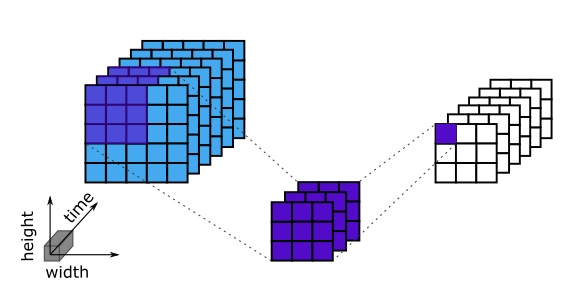
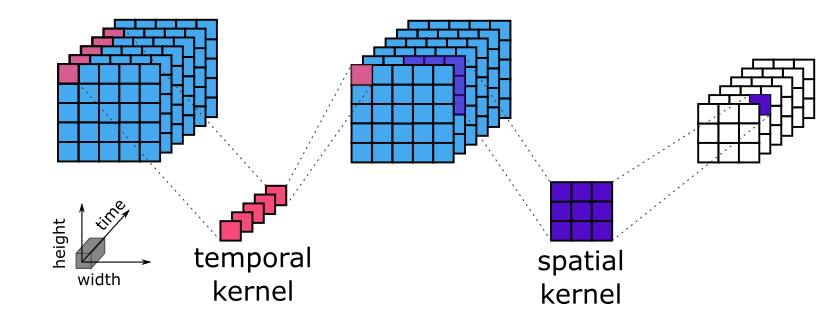
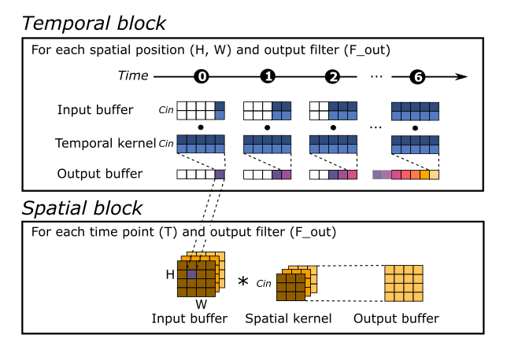

.. DO NOT EDIT.
.. THIS FILE WAS AUTOMATICALLY GENERATED BY SPHINX-GALLERY.
.. TO MAKE CHANGES, EDIT THE SOURCE PYTHON FILE:
.. "examples/spatiotemporal/plot_0_introduction_to_spatiotemporal_models.py"
.. LINE NUMBERS ARE GIVEN BELOW.

.. only:: html

    .. note::
        :class: sphx-glr-download-link-note

        :ref:`Go to the end <sphx_glr_download_examples_spatiotemporal_plot_0_introduction_to_spatiotemporal_models.py>`
        to download the full example code.

.. rst-class:: sphx-glr-example-title

.. _sphx_glr_examples_spatiotemporal_plot_0_introduction_to_spatiotemporal_models.py:

Gesture recognition with spatiotemporal models
==============================================

A tutorial on designing efficient models for streaming video tasks.

.. GENERATED FROM PYTHON SOURCE LINES 9-27

1. Introduction: why spatiotemporal models?
-------------------------------------------

Recognizing gestures from video is a challenging task that requires understanding not just
individual frames but how those frames evolve over time. Traditional 2D convolutional neural
networks (CNNs) are limited here — they analyze only spatial features and discard temporal
continuity. 3D CNNs, while well suited to the task, are on the other hand computationally heavy.

To tackle this, we turn to lightweight spatiotemporal models, specifically designed to process
patterns in both space (image structure) and time (motion, rhythm). These models are essential
for tasks like:

* Gesture classification
* Online eye-tracking
* Real-time activity detection in video streams

At the heart of these models lies a simple idea: decoupling spatial and temporal analysis,
enables efficient, real-time detection — even on resource-constrained devices.

.. GENERATED FROM PYTHON SOURCE LINES 29-60

2. Spatiotemporal blocks: the core concept
------------------------------------------

Rather than using full, computationally expensive 3D convolutions, our spatiotemporal blocks break
the operation into two parts, a:

1. Temporal convolution, which focuses on changes over time for each spatial pixel (e.g. motion).
2. Spatial convolution, which looks at image structure in each frame (e.g. shape, position).

The figures below highlights the difference between a full 3D convolution kernel versus our
spatiotemporal convolution (a.k.a. TENN in the figure below).

   3D convolutions example

   Spatiotemporal convolutions example

This factorized approach reduces compute requirements. In fact, this design proved effective in
very different domains: it was applied to gesture videos as well as event-based eye tracking
(see tutorial).

.. GENERATED FROM PYTHON SOURCE LINES 62-93

2.1. Making it efficient using depthwise separable convolutions
^^^^^^^^^^^^^^^^^^^^^^^^^^^^^^^^^^^^^^^^^^^^^^^^^^^^^^^^^^^^^^^

To further reduce the computational load of the blocks, we can make them separable, just like
depthwise separable convolutions replace full convolutions, reducing computation with minimal
accuracy loss, our decomposed temporal-spatial convolutions can also be made separable using
an approach inspired by the `MobileNet paper <https://arxiv.org/abs/1704.04861>`__. Each layer
from the spatiotemporal block is decomposed into 2: the temporal convolution is
transformed into a depthwise temporal convolutional layer followed by a pointwise convolutional
layer (see figure above), the same is done for the spatial convolution.

.. Note::
  The design of these spatiotemporal blocks is similar to R(2+1)D blocks, except we place the
  temporal layer first. Doing this preserves the temporal richness of the raw input — a critical
  decision that avoids "smearing" out important movement cues. Moreover, notice that our temporal
  layers do not have a stride (compared to R(2+1)D layers).

.. figure:: ../../img/comparing_3D_conv_block_designs.png
   :target: ../../_images/comparing_3D_conv_block_designs.png
   :alt: various types of 3D convolutions
   :scale: 60 %
   :align: center

   Kernel dimensions and strides for various types of 3D convolutions. Dotted lines show depthwise
   convolutions. Full lines show full convolutions. Orange outlines are for spatial 3D convs and
   purple ones for temporal convolutions.

A spatiotemporal block can be easily built using the predefined spatiotemporal
blocks from Akida models available through the `akida_models.layer_blocks.spatiotemporal_block
<../../api_reference/akida_models_apis.html#akida_models.layer_blocks.spatiotemporal_block>`__
API.

.. GENERATED FROM PYTHON SOURCE LINES 95-105

3. Building the model: from blocks to network
---------------------------------------------

Our gesture recognition model stacks 5 spatiotemporal blocks, forming a shallow yet expressive
network. This depth allows the model to:

- Gradually capture complex temporal patterns (e.g. "swipe up", "rotate clockwise")
- Downsample spatially to control compute load
- Preserve fine-grained timing via non-strided temporal layers
- Easily train without skip connections

.. GENERATED FROM PYTHON SOURCE LINES 107-116

.. code-block:: Python

    input_shape = (100, 100, 3)
    sampling_frequency = 16
    n_classes = 27

    from akida_models.tenn_spatiotemporal import tenn_spatiotemporal_jester
    model = tenn_spatiotemporal_jester(input_shape=(sampling_frequency,) + input_shape,
                                       n_classes=n_classes)
    model.summary()

.. rst-class:: sphx-glr-script-out

 .. code-block:: none

    Model: "jester_video"
    _________________________________________________________________
     Layer (type)                Output Shape              Param #   
    =================================================================
     input (InputLayer)          [(None, 16, 100, 100, 3   0         
                                 )]                                  
                                                                 
     rescaling (Rescaling)       (None, 16, 100, 100, 3)   0         
                                                                 
     input_conv (Conv3D)         (None, 16, 50, 50, 8)     216       
                                                                 
     input_conv/BN (BatchNormal  (None, 16, 50, 50, 8)     32        
     ization)                                                        
                                                                 
     input_conv/relu (ReLU)      (None, 16, 50, 50, 8)     0         
                                                                 
     activity_regularization (A  (None, 16, 50, 50, 8)     0         
     ctivityRegularization)                                          
                                                                 
     zero_padding3d (ZeroPaddin  (None, 20, 50, 50, 8)     0         
     g3D)                                                            
                                                                 
     convt_full_0_0 (Conv3D)     (None, 16, 50, 50, 20)    820       
                                                                 
     convt_full_0_0/BN (BatchNo  (None, 16, 50, 50, 20)    80        
     rmalization)                                                    
                                                                 
     convt_full_0_0/relu (ReLU)  (None, 16, 50, 50, 20)    0         
                                                                 
     activity_regularization_1   (None, 16, 50, 50, 20)    0         
     (ActivityRegularization)                                        
                                                                 
     convs_full_0_0 (Conv3D)     (None, 16, 25, 25, 40)    7240      
                                                                 
     convs_full_0_0/BN (BatchNo  (None, 16, 25, 25, 40)    160       
     rmalization)                                                    
                                                                 
     convs_full_0_0/relu (ReLU)  (None, 16, 25, 25, 40)    0         
                                                                 
     activity_regularization_2   (None, 16, 25, 25, 40)    0         
     (ActivityRegularization)                                        
                                                                 
     zero_padding3d_1 (ZeroPadd  (None, 20, 25, 25, 40)    0         
     ing3D)                                                          
                                                                 
     convt_full_1_0 (Conv3D)     (None, 16, 25, 25, 80)    16080     
                                                                 
     convt_full_1_0/BN (BatchNo  (None, 16, 25, 25, 80)    320       
     rmalization)                                                    
                                                                 
     convt_full_1_0/relu (ReLU)  (None, 16, 25, 25, 80)    0         
                                                                 
     activity_regularization_3   (None, 16, 25, 25, 80)    0         
     (ActivityRegularization)                                        
                                                                 
     convs_full_1_0 (Conv3D)     (None, 16, 13, 13, 120)   86520     
                                                                 
     convs_full_1_0/BN (BatchNo  (None, 16, 13, 13, 120)   480       
     rmalization)                                                    
                                                                 
     convs_full_1_0/relu (ReLU)  (None, 16, 13, 13, 120)   0         
                                                                 
     activity_regularization_4   (None, 16, 13, 13, 120)   0         
     (ActivityRegularization)                                        
                                                                 
     zero_padding3d_2 (ZeroPadd  (None, 20, 13, 13, 120)   0         
     ing3D)                                                          
                                                                 
     convt_full_2_0 (Conv3D)     (None, 16, 13, 13, 160)   96160     
                                                                 
     convt_full_2_0/BN (BatchNo  (None, 16, 13, 13, 160)   640       
     rmalization)                                                    
                                                                 
     convt_full_2_0/relu (ReLU)  (None, 16, 13, 13, 160)   0         
                                                                 
     activity_regularization_5   (None, 16, 13, 13, 160)   0         
     (ActivityRegularization)                                        
                                                                 
     convs_full_2_0 (Conv3D)     (None, 16, 7, 7, 200)     288200    
                                                                 
     convs_full_2_0/BN (BatchNo  (None, 16, 7, 7, 200)     800       
     rmalization)                                                    
                                                                 
     convs_full_2_0/relu (ReLU)  (None, 16, 7, 7, 200)     0         
                                                                 
     activity_regularization_6   (None, 16, 7, 7, 200)     0         
     (ActivityRegularization)                                        
                                                                 
     zero_padding3d_3 (ZeroPadd  (None, 20, 7, 7, 200)     0         
     ing3D)                                                          
                                                                 
     convt_dw_3_0 (Conv3D)       (None, 16, 7, 7, 200)     1000      
                                                                 
     convt_dw_3_0/BN (BatchNorm  (None, 16, 7, 7, 200)     800       
     alization)                                                      
                                                                 
     convt_dw_3_0/relu (ReLU)    (None, 16, 7, 7, 200)     0         
                                                                 
     activity_regularization_7   (None, 16, 7, 7, 200)     0         
     (ActivityRegularization)                                        
                                                                 
     convt_pw_3_0 (Conv3D)       (None, 16, 7, 7, 240)     48240     
                                                                 
     convt_pw_3_0/BN (BatchNorm  (None, 16, 7, 7, 240)     960       
     alization)                                                      
                                                                 
     convt_pw_3_0/relu (ReLU)    (None, 16, 7, 7, 240)     0         
                                                                 
     activity_regularization_8   (None, 16, 7, 7, 240)     0         
     (ActivityRegularization)                                        
                                                                 
     convs_dw_3_0 (Conv3D)       (None, 16, 4, 4, 240)     2160      
                                                                 
     convs_dw_3_0/BN (BatchNorm  (None, 16, 4, 4, 240)     960       
     alization)                                                      
                                                                 
     convs_dw_3_0/relu (ReLU)    (None, 16, 4, 4, 240)     0         
                                                                 
     activity_regularization_9   (None, 16, 4, 4, 240)     0         
     (ActivityRegularization)                                        
                                                                 
     convs_pw_3_0 (Conv3D)       (None, 16, 4, 4, 280)     67480     
                                                                 
     convs_pw_3_0/BN (BatchNorm  (None, 16, 4, 4, 280)     1120      
     alization)                                                      
                                                                 
     convs_pw_3_0/relu (ReLU)    (None, 16, 4, 4, 280)     0         
                                                                 
     activity_regularization_10  (None, 16, 4, 4, 280)     0         
      (ActivityRegularization)                                       
                                                                 
     zero_padding3d_4 (ZeroPadd  (None, 20, 4, 4, 280)     0         
     ing3D)                                                          
                                                                 
     convt_dw_4_0 (Conv3D)       (None, 16, 4, 4, 280)     1400      
                                                                 
     convt_dw_4_0/BN (BatchNorm  (None, 16, 4, 4, 280)     1120      
     alization)                                                      
                                                                 
     convt_dw_4_0/relu (ReLU)    (None, 16, 4, 4, 280)     0         
                                                                 
     activity_regularization_11  (None, 16, 4, 4, 280)     0         
      (ActivityRegularization)                                       
                                                                 
     convt_pw_4_0 (Conv3D)       (None, 16, 4, 4, 320)     89920     
                                                                 
     convt_pw_4_0/BN (BatchNorm  (None, 16, 4, 4, 320)     1280      
     alization)                                                      
                                                                 
     convt_pw_4_0/relu (ReLU)    (None, 16, 4, 4, 320)     0         
                                                                 
     activity_regularization_12  (None, 16, 4, 4, 320)     0         
      (ActivityRegularization)                                       
                                                                 
     convs_dw_4_0 (Conv3D)       (None, 16, 2, 2, 320)     2880      
                                                                 
     convs_dw_4_0/BN (BatchNorm  (None, 16, 2, 2, 320)     1280      
     alization)                                                      
                                                                 
     convs_dw_4_0/relu (ReLU)    (None, 16, 2, 2, 320)     0         
                                                                 
     activity_regularization_13  (None, 16, 2, 2, 320)     0         
      (ActivityRegularization)                                       
                                                                 
     convs_pw_4_0 (Conv3D)       (None, 16, 2, 2, 640)     205440    
                                                                 
     convs_pw_4_0/BN (BatchNorm  (None, 16, 2, 2, 640)     2560      
     alization)                                                      
                                                                 
     convs_pw_4_0/relu (ReLU)    (None, 16, 2, 2, 640)     0         
                                                                 
     activity_regularization_14  (None, 16, 2, 2, 640)     0         
      (ActivityRegularization)                                       
                                                                 
     gap (AveragePooling3D)      (None, 16, 1, 1, 640)     0         
                                                                 
     dense_1 (Dense)             (None, 16, 1, 1, 640)     410240    
                                                                 
     re_lu_7 (ReLU)              (None, 16, 1, 1, 640)     0         
                                                                 
     dense_2 (Dense)             (None, 16, 1, 1, 27)      17307     
                                                                 
    =================================================================
    Total params: 1353895 (5.16 MB)
    Trainable params: 1347599 (5.14 MB)
    Non-trainable params: 6296 (24.59 KB)
    _________________________________________________________________

.. GENERATED FROM PYTHON SOURCE LINES 117-123

3.1 Preserving temporal information
^^^^^^^^^^^^^^^^^^^^^^^^^^^^^^^^^^^
As you can see from the summary, the model ends with an 3D average pooling applied only
on the spatial dimensions. This ensures that the model can make predictions after the
first input frame, preserving fine-grained temporal dynamics and bufferized inference
(see section 6.)

.. GENERATED FROM PYTHON SOURCE LINES 125-138

4. Gesture classification in videos
-----------------------------------

In this tutorial, we use the `Jester dataset
<https://www.qualcomm.com/developer/software/jester-dataset>`__,
a gesture recognition dataset specifically designed to include movements targeted at human/machine
interactions. To do well on the task, information needs to be aggregated across time to accurately
separate complex gestures such as clockwise or counterclowise hand turning.

The data is available to download in the form of zip files from the
`qualcomm website <https://www.qualcomm.com/developer/software/jester-dataset>`__ along with
`download instructions
<https://www.qualcomm.com/content/dam/qcomm-martech/dm-assets/documents/qualcomm-ai-research-jester-download-instructions-v2.pdf>`__.

.. GENERATED FROM PYTHON SOURCE LINES 140-151

4.1 Dataset description
^^^^^^^^^^^^^^^^^^^^^^^
In the jester dataset, each sample is a short video clip (about 3 seconds) recorded through a
webcam with fixed resolution of 100 pixels in height and a frame rate of 12 FPS. There are in
total 148,092 videos of 27 different complex gestures covering examples such as "Zooming Out With
2 fingers", "Rolling Hand Forward", "Shaking Hand", "Stop Sign", "Swiping Left", etc..., also
including a "no gesture" and a "other movements" classes.

It is a rich and varied dataset with over 1300 different actors performing the gestures.
The dataset has determined splits for training, validation and testing with the ratio of
80%/10%/10%.

.. GENERATED FROM PYTHON SOURCE LINES 153-170

4.2 Data preprocessing
^^^^^^^^^^^^^^^^^^^^^^
To train the model effectively, we apply minimal preprocessing:

- Extract a fixed number of frames (here 16 frames) per sample
- Use strided sampling (stride=2) to reduce redundancy and speed up training
- Resize the input to a fixed input size (100, 100)
- Normalize inputs (between -1 and 1)
- Optionally apply an affine transform for training data (ie. randomly and independently apply
  translation, scaling, shearing and rotation to each video).

The dataset is too large to load completely in a tutorial. If you download the dataset
at the links mentioned above, you can load and preprocess it using the get_data API
available under akida_models.tenn_spatiotemporal.jester_train.

Alternatively, the first few validation samples have been set aside and
can be loaded here to demonstration purposes.

.. GENERATED FROM PYTHON SOURCE LINES 172-192

.. code-block:: Python

    batch_size = 8

    # Download and load validation subset from Brainchip data server
    import os
    from akida_models import fetch_file
    from akida_models.tenn_spatiotemporal.jester_train import get_data

    data_path = fetch_file(
        fname="jester_subset.tar.gz",
        origin="https://data.brainchip.com/dataset-mirror/jester/jester_subset.tar.gz",
        cache_subdir=os.path.join("datasets", "jester"), extract=True)
    data_dir = os.path.join(os.path.dirname(data_path), "jester_subset")
    val_dataset, val_steps = get_data("val", data_dir, sampling_frequency, input_shape[:2], batch_size)

    # Decode numeric labels into human readable ones: contains all string names for classes
    # available in the dataset
    import csv
    with open(os.path.join(data_dir, "jester-v1-labels.csv")) as csvfile:
        class_names = [row[0] for row in csv.reader(csvfile)]

.. rst-class:: sphx-glr-script-out

 .. code-block:: none

    Downloading data from https://data.brainchip.com/dataset-mirror/jester/jester_subset.tar.gz.

            0/105037345 [..............................] - ETA: 0s
       188416/105037345 [..............................] - ETA: 30s
       778240/105037345 [..............................] - ETA: 14s
      1564672/105037345 [..............................] - ETA: 10s
      2416640/105037345 [..............................] - ETA: 8s 
      3268608/105037345 [..............................] - ETA: 7s
      4120576/105037345 [>.............................] - ETA: 7s
      5169152/105037345 [>.............................] - ETA: 6s
      6332416/105037345 [>.............................] - ETA: 6s
      7577600/105037345 [=>............................] - ETA: 5s
      8478720/105037345 [=>............................] - ETA: 5s
      9969664/105037345 [=>............................] - ETA: 5s
     10952704/105037345 [==>...........................] - ETA: 5s
     12312576/105037345 [==>...........................] - ETA: 5s
     13836288/105037345 [==>...........................] - ETA: 4s
     14770176/105037345 [===>..........................] - ETA: 4s
     16801792/105037345 [===>..........................] - ETA: 4s
     18055168/105037345 [====>.........................] - ETA: 4s
     19144704/105037345 [====>.........................] - ETA: 4s
     20291584/105037345 [====>.........................] - ETA: 4s
     21504000/105037345 [=====>........................] - ETA: 4s
     22470656/105037345 [=====>........................] - ETA: 4s
     23945216/105037345 [=====>........................] - ETA: 3s
     24854528/105037345 [======>.......................] - ETA: 3s
     26181632/105037345 [======>.......................] - ETA: 3s
     27369472/105037345 [======>.......................] - ETA: 3s
     28401664/105037345 [=======>......................] - ETA: 3s
     29859840/105037345 [=======>......................] - ETA: 3s
     30695424/105037345 [=======>......................] - ETA: 3s
     31678464/105037345 [========>.....................] - ETA: 3s
     32825344/105037345 [========>.....................] - ETA: 3s
     33587200/105037345 [========>.....................] - ETA: 3s
     34725888/105037345 [========>.....................] - ETA: 3s
     35840000/105037345 [=========>....................] - ETA: 3s
     37134336/105037345 [=========>....................] - ETA: 3s
     38510592/105037345 [=========>....................] - ETA: 3s
     39854080/105037345 [==========>...................] - ETA: 3s
     41287680/105037345 [==========>...................] - ETA: 2s
     42524672/105037345 [===========>..................] - ETA: 2s
     43769856/105037345 [===========>..................] - ETA: 2s
     45146112/105037345 [===========>..................] - ETA: 2s
     46276608/105037345 [============>.................] - ETA: 2s
     47521792/105037345 [============>.................] - ETA: 2s
     49029120/105037345 [=============>................] - ETA: 2s
     50126848/105037345 [=============>................] - ETA: 2s
     51503104/105037345 [=============>................] - ETA: 2s
     52879360/105037345 [==============>...............] - ETA: 2s
     54042624/105037345 [==============>...............] - ETA: 2s
     55533568/105037345 [==============>...............] - ETA: 2s
     56713216/105037345 [===============>..............] - ETA: 2s
     57876480/105037345 [===============>..............] - ETA: 2s
     59400192/105037345 [===============>..............] - ETA: 2s
     61104128/105037345 [================>.............] - ETA: 1s
     62382080/105037345 [================>.............] - ETA: 1s
     63504384/105037345 [=================>............] - ETA: 1s
     64561152/105037345 [=================>............] - ETA: 1s
     65855488/105037345 [=================>............] - ETA: 1s
     67002368/105037345 [==================>...........] - ETA: 1s
     68018176/105037345 [==================>...........] - ETA: 1s
     69361664/105037345 [==================>...........] - ETA: 1s
     70197248/105037345 [===================>..........] - ETA: 1s
     71540736/105037345 [===================>..........] - ETA: 1s
     72687616/105037345 [===================>..........] - ETA: 1s
     73703424/105037345 [====================>.........] - ETA: 1s
     75046912/105037345 [====================>.........] - ETA: 1s
     76013568/105037345 [====================>.........] - ETA: 1s
     77389824/105037345 [=====================>........] - ETA: 1s
     78553088/105037345 [=====================>........] - ETA: 1s
     79552512/105037345 [=====================>........] - ETA: 1s
     81010688/105037345 [======================>.......] - ETA: 1s
     82124800/105037345 [======================>.......] - ETA: 1s
     83509248/105037345 [======================>.......] - ETA: 0s
     84639744/105037345 [=======================>......] - ETA: 0s
     85729280/105037345 [=======================>......] - ETA: 0s
     87072768/105037345 [=======================>......] - ETA: 0s
     88006656/105037345 [========================>.....] - ETA: 0s
     89415680/105037345 [========================>.....] - ETA: 0s
     90497024/105037345 [========================>.....] - ETA: 0s
     91774976/105037345 [=========================>....] - ETA: 0s
     93020160/105037345 [=========================>....] - ETA: 0s
     94085120/105037345 [=========================>....] - ETA: 0s
     94806016/105037345 [==========================>...] - ETA: 0s
     96116736/105037345 [==========================>...] - ETA: 0s
     97083392/105037345 [==========================>...] - ETA: 0s
     98459648/105037345 [===========================>..] - ETA: 0s
     99426304/105037345 [===========================>..] - ETA: 0s
    100851712/105037345 [===========================>..] - ETA: 0s
    101785600/105037345 [============================>.] - ETA: 0s
    103227392/105037345 [============================>.] - ETA: 0s
    104341504/105037345 [============================>.] - ETA: 0s
    105037345/105037345 [==============================] - 5s 0us/step
    Download complete.

.. GENERATED FROM PYTHON SOURCE LINES 193-196

.. code-block:: Python

    print(f"classes available are : {class_names}")

.. rst-class:: sphx-glr-script-out

 .. code-block:: none

    classes available are : ['Swiping Left', 'Swiping Right', 'Swiping Down', 'Swiping Up', 'Pushing Hand Away', 'Pulling Hand In', 'Sliding Two Fingers Left', 'Sliding Two Fingers Right', 'Sliding Two Fingers Down', 'Sliding Two Fingers Up', 'Pushing Two Fingers Away', 'Pulling Two Fingers In', 'Rolling Hand Forward', 'Rolling Hand Backward', 'Turning Hand Clockwise', 'Turning Hand Counterclockwise', 'Zooming In With Full Hand', 'Zooming Out With Full Hand', 'Zooming In With Two Fingers', 'Zooming Out With Two Fingers', 'Thumb Up', 'Thumb Down', 'Shaking Hand', 'Stop Sign', 'Drumming Fingers', 'No gesture', 'Doing other things']

.. GENERATED FROM PYTHON SOURCE LINES 197-214

5. Training and evaluating the model
------------------------------------

The model is trained using standard techniques: Adam optimizer, cosine LR scheduler and
Categorical Cross-Entropy. We modify the categorical crossentropy slightly to make it "temporal":
the target class (y-label) is replicated at each time point, thus forcing the model to correctly
classify each video frame.

Since the training requires a few GPU hours to complete, we will load a pre-trained model for
inference. Pre-trained models are available either in floating-point or quantized version.
First, we'll look at the floating-point model, available using the following apis. The evaluation
tool is also available to rapidly test the performance on the validation dataset.

.. Note: the accuracy here is low because it is computed weighing each time point equally, i.e.
         the first frame when the event has not started contributes as much to the predicted label
         as a frame with an actual movement in it. The validation accuracy will dramatically
         improve once we allow the model to weigh its output in time (see section below).

.. GENERATED FROM PYTHON SOURCE LINES 216-233

.. code-block:: Python

    from akida_models.model_io import get_model_path, load_model
    from akida_models.utils import fetch_file
    from akida_models.tenn_spatiotemporal.jester_train import compile_model

    model_name_v2 = "tenn_spatiotemporal_jester.h5"
    file_hash_v2 = "fca52a23152f7c56be1f0db59844a5babb443aaf55babed7669df35b516b8204"
    model_path, model_name, file_hash = get_model_path("tenn_spatiotemporal",
                                                       model_name_v2=model_name_v2,
                                                       file_hash_v2=file_hash_v2)
    model_path = fetch_file(model_path,
                            fname=model_name,
                            file_hash=file_hash,
                            cache_subdir='models')

    model = load_model(model_path)
    compile_model(model, 3e-4, val_steps, 1, sampling_frequency)

.. rst-class:: sphx-glr-script-out

 .. code-block:: none

    Downloading data from https://data.brainchip.com/models/AkidaV2/tenn_spatiotemporal/tenn_spatiotemporal_jester.h5.

          0/5615064 [..............................] - ETA: 0s
     131072/5615064 [..............................] - ETA: 2s
     835584/5615064 [===>..........................] - ETA: 0s
    1703936/5615064 [========>.....................] - ETA: 0s
    2686976/5615064 [=============>................] - ETA: 0s
    3629056/5615064 [==================>...........] - ETA: 0s
    4366336/5615064 [======================>.......] - ETA: 0s
    5521408/5615064 [============================>.] - ETA: 0s
    5615064/5615064 [==============================] - 0s 0us/step
    Download complete.

.. GENERATED FROM PYTHON SOURCE LINES 234-238

.. code-block:: Python

    hist = model.evaluate(val_dataset)
    print(hist)

.. rst-class:: sphx-glr-script-out

 .. code-block:: none


          1/Unknown - 1s 1s/step - loss: 1.4189 - temporal_accuracy: 0.7422
          4/Unknown - 1s 20ms/step - loss: 1.3319 - temporal_accuracy: 0.7598
          7/Unknown - 1s 18ms/step - loss: 1.4040 - temporal_accuracy: 0.7366
         10/Unknown - 1s 19ms/step - loss: 1.4774 - temporal_accuracy: 0.7164
         13/Unknown - 2s 19ms/step - loss: 1.5823 - temporal_accuracy: 0.6983
         16/Unknown - 2s 19ms/step - loss: 1.5785 - temporal_accuracy: 0.6948
         19/Unknown - 2s 19ms/step - loss: 1.5567 - temporal_accuracy: 0.6982
         22/Unknown - 2s 18ms/step - loss: 1.5506 - temporal_accuracy: 0.7006
         26/Unknown - 2s 18ms/step - loss: 1.5140 - temporal_accuracy: 0.7106
         29/Unknown - 2s 18ms/step - loss: 1.5017 - temporal_accuracy: 0.7166
         33/Unknown - 2s 18ms/step - loss: 1.5164 - temporal_accuracy: 0.7079
         37/Unknown - 2s 18ms/step - loss: 1.4999 - temporal_accuracy: 0.7128
         40/Unknown - 2s 18ms/step - loss: 1.4918 - temporal_accuracy: 0.7145
         44/Unknown - 2s 17ms/step - loss: 1.5109 - temporal_accuracy: 0.7065
         48/Unknown - 2s 17ms/step - loss: 1.4955 - temporal_accuracy: 0.7121
         51/Unknown - 2s 17ms/step - loss: 1.4921 - temporal_accuracy: 0.7140
         55/Unknown - 2s 17ms/step - loss: 1.4801 - temporal_accuracy: 0.7185
         58/Unknown - 2s 17ms/step - loss: 1.4916 - temporal_accuracy: 0.7142
         62/Unknown - 2s 17ms/step - loss: 1.4851 - temporal_accuracy: 0.7169
         66/Unknown - 2s 17ms/step - loss: 1.4923 - temporal_accuracy: 0.7126
         68/Unknown - 3s 25ms/step - loss: 1.4964 - temporal_accuracy: 0.7115
    68/68 [==============================] - 3s 25ms/step - loss: 1.4964 - temporal_accuracy: 0.7115
    [1.4963831901550293, 0.711529552936554]

.. GENERATED FROM PYTHON SOURCE LINES 239-255

6. Streaming inference: making real-time predictions
----------------------------------------------------

Once trained, these models can be deployed in online inference mode, making predictions
frame-by-frame. This works thanks to:

- **causal convolutions**, which ensure that predictions at time *t* use only past and current
  frames, not future ones by adding (left-sided) zero-padding. This is critical for streaming
  inference where latency matters: we want to be able to make predictions immediately. Our
  causal temporal layers don't rely on future frames and start making predictions after the
  first frame is received.
- **not using a temporal stride**: our model purposefully preserves time information and thus
  is able to make a classification guess after each incoming frame.

These choices also allow us to configure the spatio-temporal layer in a efficient way using
FIFO buffers during inference.

.. GENERATED FROM PYTHON SOURCE LINES 257-309

6.1 FIFO buffering
^^^^^^^^^^^^^^^^^^

During inference, each temporal layer is replaced with a bufferized 2D convolution: i.e. a
Conv2D with an input buffer the size of its kernel (initialized with zeros), handling the
streaming input features. Spatial convolutions that have a temporal kernel size of 1 can be
seamlessly transformed into 2D convolutions too.

At its core, a convolution (whether 2D or 3D) involves sliding a small filter (also called
a kernel) over the input data and computing a dot product between the filter and a small
segment (or window) of the input at each step.

To make this process more efficient, we can use a FIFO (First In, First Out) buffer to
automatically manage the sliding window. Here's how it works:

- The input buffer holds the most recent values from the input signal (top row on the figure
  above).
- The size of this buffer is equal to the size of the temporal kernel.
- After each new incoming values, we perform a dot product between the buffer contents and the
  kernel to produce one output value.
- Every time a new input value arrives, it's added to the buffer, and the oldest value is
  removed.

This works seamlessly in causal convolutional networks, where the output at any time step only
depends on the current and past input values—not future ones. Because of this causality, the
buffer never needs to "wait" for future input: it can compute the output as soon as the first
frame comes in.

**The result?**: Real-time gesture classification, running continuously, with predictions
ready after every frame.

**How to?**: Quantization will automatically transform compatible spatiotemporal blocks into
their equivalent bufferized version during the *sanitizing* step.

.. Note::

  - After conversion, the 3D Convolution layers are transformed into custom
    `BufferTempConv <../../api_reference/quantizeml_apis.html#quantizeml.layers.BufferTempConv>`__
    layers.
  - As opposed to training where the whole 16 frames samples is passed to the model, the inference
    model requires samples to be passed one by one.
  - For a better understanding of the buffering process, the sections below will explicitly use
    `quantizeml.models.transforms.sanitize
    <../../api_reference/quantizeml_apis.html#quantizeml.models.transforms.sanitize>`__ to convert
    the model to its bufferized version. This is not necessary in practice, as the conversion is
    done automatically during quantization (see section 8 below).

.. GENERATED FROM PYTHON SOURCE LINES 311-315

.. code-block:: Python

    from quantizeml.models.transforms import sanitize
    model_buffer = sanitize(model)
    model_buffer.summary()

.. rst-class:: sphx-glr-script-out

 .. code-block:: none

    Model: "jester_video"
    _________________________________________________________________
     Layer (type)                Output Shape              Param #   
    =================================================================
     input (InputLayer)          [(None, 100, 100, 3)]     0         
                                                                 
     rescaling (Rescaling)       (None, 100, 100, 3)       0         
                                                                 
     input_conv (Conv2D)         (None, 50, 50, 8)         224       
                                                                 
     input_conv/relu (ReLU)      (None, 50, 50, 8)         0         
                                                                 
     convt_full_1_0 (BufferTemp  (None, 50, 50, 20)        820       
     Conv)                                                           
                                                                 
     convt_full_1_0/relu (ReLU)  (None, 50, 50, 20)        0         
                                                                 
     convs_full_1_0 (Conv2D)     (None, 25, 25, 40)        7240      
                                                                 
     convs_full_1_0/relu (ReLU)  (None, 25, 25, 40)        0         
                                                                 
     convt_full_2_0 (BufferTemp  (None, 25, 25, 80)        16080     
     Conv)                                                           
                                                                 
     convt_full_2_0/relu (ReLU)  (None, 25, 25, 80)        0         
                                                                 
     convs_full_2_0 (Conv2D)     (None, 13, 13, 120)       86520     
                                                                 
     convs_full_2_0/relu (ReLU)  (None, 13, 13, 120)       0         
                                                                 
     convt_full_3_0 (BufferTemp  (None, 13, 13, 160)       96160     
     Conv)                                                           
                                                                 
     convt_full_3_0/relu (ReLU)  (None, 13, 13, 160)       0         
                                                                 
     convs_full_3_0 (Conv2D)     (None, 7, 7, 200)         288200    
                                                                 
     convs_full_3_0/relu (ReLU)  (None, 7, 7, 200)         0         
                                                                 
     convt_dw_4_0 (DepthwiseBuf  (None, 7, 7, 200)         1200      
     ferTempConv)                                                    
                                                                 
     convt_dw_4_0/relu (ReLU)    (None, 7, 7, 200)         0         
                                                                 
     convt_pw_4_0 (Conv2D)       (None, 7, 7, 240)         48240     
                                                                 
     convt_pw_4_0/relu (ReLU)    (None, 7, 7, 240)         0         
                                                                 
     convs_dw_4_0 (DepthwiseCon  (None, 4, 4, 240)         2400      
     v2D)                                                            
                                                                 
     convs_dw_4_0/relu (ReLU)    (None, 4, 4, 240)         0         
                                                                 
     convs_pw_4_0 (Conv2D)       (None, 4, 4, 280)         67480     
                                                                 
     convs_pw_4_0/relu (ReLU)    (None, 4, 4, 280)         0         
                                                                 
     convt_dw_5_0 (DepthwiseBuf  (None, 4, 4, 280)         1680      
     ferTempConv)                                                    
                                                                 
     convt_dw_5_0/relu (ReLU)    (None, 4, 4, 280)         0         
                                                                 
     convt_pw_5_0 (Conv2D)       (None, 4, 4, 320)         89920     
                                                                 
     convt_pw_5_0/relu (ReLU)    (None, 4, 4, 320)         0         
                                                                 
     convs_dw_5_0 (DepthwiseCon  (None, 2, 2, 320)         3200      
     v2D)                                                            
                                                                 
     convs_dw_5_0/relu (ReLU)    (None, 2, 2, 320)         0         
                                                                 
     convs_pw_5_0 (Conv2D)       (None, 2, 2, 640)         205440    
                                                                 
     convs_pw_5_0/relu (ReLU)    (None, 2, 2, 640)         0         
                                                                 
     gap (GlobalAveragePooling2  (None, 640)               0         
     D)                                                              
                                                                 
     dense (Dense)               (None, 640)               410240    
                                                                 
     re_lu (ReLU)                (None, 640)               0         
                                                                 
     dense_1 (Dense)             (None, 27)                17307     
                                                                 
    =================================================================
    Total params: 1342351 (5.12 MB)
    Trainable params: 1226411 (4.68 MB)
    Non-trainable params: 115940 (452.89 KB)
    _________________________________________________________________

.. GENERATED FROM PYTHON SOURCE LINES 316-318

The models then can be evaluated on the data using the helper available that passes
data frame by frame to the model, accumulating the model's responses

.. GENERATED FROM PYTHON SOURCE LINES 318-321

.. code-block:: Python

    from akida_models.tenn_spatiotemporal.jester_train import evaluate_bufferized_model
    evaluate_bufferized_model(model_buffer, val_dataset, val_steps // batch_size, in_akida=False)

.. rst-class:: sphx-glr-script-out

 .. code-block:: none


      0%|          | 0/231 [00:00<?, ?it/s]
      0%|          | 1/231 [00:00<02:00,  1.91it/s]
      2%|▏         | 4/231 [00:00<00:29,  7.65it/s]
      3%|▎         | 7/231 [00:00<00:18, 12.36it/s]
      4%|▍         | 10/231 [00:00<00:13, 16.10it/s]
      6%|▌         | 13/231 [00:00<00:11, 18.89it/s]
      7%|▋         | 16/231 [00:01<00:10, 21.02it/s]
      8%|▊         | 19/231 [00:01<00:09, 22.61it/s]
     10%|▉         | 22/231 [00:01<00:08, 23.75it/s]
     11%|█         | 25/231 [00:01<00:08, 24.54it/s]
     12%|█▏        | 28/231 [00:01<00:08, 25.13it/s]
     13%|█▎        | 31/231 [00:01<00:07, 25.42it/s]
     15%|█▍        | 34/231 [00:01<00:07, 25.69it/s]
     16%|█▌        | 37/231 [00:01<00:07, 25.92it/s]
     17%|█▋        | 40/231 [00:02<00:07, 26.16it/s]
     19%|█▊        | 43/231 [00:02<00:07, 26.14it/s]
     20%|█▉        | 46/231 [00:02<00:07, 26.20it/s]
     21%|██        | 49/231 [00:02<00:06, 26.27it/s]
     23%|██▎       | 52/231 [00:02<00:06, 26.28it/s]
     24%|██▍       | 55/231 [00:02<00:06, 26.41it/s]
     25%|██▌       | 58/231 [00:02<00:06, 26.41it/s]
     26%|██▋       | 61/231 [00:02<00:06, 26.34it/s]
     28%|██▊       | 64/231 [00:02<00:06, 26.39it/s]
     29%|██▉       | 67/231 [00:03<00:06, 27.26it/s]
     29%|██▉       | 68/231 [00:03<00:08, 20.14it/s]
    Accuracy:  95.01%

.. GENERATED FROM PYTHON SOURCE LINES 322-336

6.2 Weighing information
^^^^^^^^^^^^^^^^^^^^^^^^

The performance of the buffered model is improved because we use a smoothing mecanism on the
model's output:

- at time *t*, the model's outputs is softmaxed
- the softmaxed values from time *t-1* are decayed (using a decay_factor of 0.8)
- the two are added

This is done across all frames available in the video.
The predicted class is only computed once all the frames have been seen by the model for the
benchmark, but it is possible for the model to predict the video's class after each new frame.
Section 7 below shows an example of this.

.. GENERATED FROM PYTHON SOURCE LINES 338-366

7. Visualizing the predictions of the model in real time
--------------------------------------------------------

Because of this buffering and how the model was trained to output a prediction after each time
step, we can effectively visualize the response of the model in time.
This part of the tutorial is heavily inspired from the tensorflow tutorial on streaming
recognition of gestures based on the `movinet models
<https://www.tensorflow.org/hub/tutorials/movinet>`__.

We pass the data through the trained model frame by frame and collect the predicted classes,
applying a softmax on the output of the model.
To make the prediction more robust, at each time step we decay the old predictions by a
decay_factor so that they contribute less and less to the final predicted class.
The decay_factor is an hyperparameter that you can play with. In practice, it slightly improves
performance by smoothing the prediction in time and reducing the impact of earlier frames to
the final prediction.

The video below shows one sample along with the probabilities of the top 5 predictions from
our bufferized spatiotemporal model at each time point.

.. video:: ../../img/streaming_preds.mp4
   :nocontrols:
   :autoplay:
   :playsinline:
   :muted:
   :loop:
   :width: 50%
   :align: center

.. GENERATED FROM PYTHON SOURCE LINES 368-372

8. Quantizing the model and convertion to Akida
-----------------------------------------------
The model can be easily quantized with no cost in accuracy. It can then be easily deployed on
hardware for online gesture recognition using the convert method from the cnn2snn package.

.. GENERATED FROM PYTHON SOURCE LINES 374-385

.. code-block:: Python

    import numpy as np
    # Get the calibration data for accurate quantization: these are a subset from the training data.
    samples = fetch_file(
        fname="jester_video_bs100.npz",
        origin="https://data.brainchip.com/dataset-mirror/samples/jester_video/jester_video_bs100.npz",
        cache_subdir=os.path.join("datasets", "jester"), extract=False)
    samples = os.path.join(os.path.dirname(data_path), "jester_video_bs100.npz")
    data = np.load(samples)
    samples_arr = np.concatenate([data[item] for item in data.files])
    num_samples = len(samples_arr)

.. rst-class:: sphx-glr-script-out

 .. code-block:: none

    Downloading data from https://data.brainchip.com/dataset-mirror/samples/jester_video/jester_video_bs100.npz.

           0/48000262 [..............................] - ETA: 0s
      212992/48000262 [..............................] - ETA: 11s
      917504/48000262 [..............................] - ETA: 5s 
     1867776/48000262 [>.............................] - ETA: 3s
     2932736/48000262 [>.............................] - ETA: 3s
     4128768/48000262 [=>............................] - ETA: 2s
     5046272/48000262 [==>...........................] - ETA: 2s
     6324224/48000262 [==>...........................] - ETA: 2s
     7405568/48000262 [===>..........................] - ETA: 2s
     8847360/48000262 [====>.........................] - ETA: 2s
     9895936/48000262 [=====>........................] - ETA: 1s
    11091968/48000262 [=====>........................] - ETA: 1s
    12541952/48000262 [======>.......................] - ETA: 1s
    13787136/48000262 [=======>......................] - ETA: 1s
    14893056/48000262 [========>.....................] - ETA: 1s
    17006592/48000262 [=========>....................] - ETA: 1s
    18104320/48000262 [==========>...................] - ETA: 1s
    19628032/48000262 [===========>..................] - ETA: 1s
    20660224/48000262 [===========>..................] - ETA: 1s
    22069248/48000262 [============>.................] - ETA: 1s
    23330816/48000262 [=============>................] - ETA: 1s
    24379392/48000262 [==============>...............] - ETA: 1s
    25804800/48000262 [===============>..............] - ETA: 0s
    27033600/48000262 [===============>..............] - ETA: 0s
    28082176/48000262 [================>.............] - ETA: 0s
    29646848/48000262 [=================>............] - ETA: 0s
    30588928/48000262 [==================>...........] - ETA: 0s
    31817728/48000262 [==================>...........] - ETA: 0s
    33095680/48000262 [===================>..........] - ETA: 0s
    34045952/48000262 [====================>.........] - ETA: 0s
    35176448/48000262 [====================>.........] - ETA: 0s
    36470784/48000262 [=====================>........] - ETA: 0s
    37371904/48000262 [======================>.......] - ETA: 0s
    38617088/48000262 [=======================>......] - ETA: 0s
    39763968/48000262 [=======================>......] - ETA: 0s
    40722432/48000262 [========================>.....] - ETA: 0s
    42008576/48000262 [=========================>....] - ETA: 0s
    42926080/48000262 [=========================>....] - ETA: 0s
    44154880/48000262 [==========================>...] - ETA: 0s
    45318144/48000262 [===========================>..] - ETA: 0s
    46301184/48000262 [===========================>..] - ETA: 0s
    47611904/48000262 [============================>.] - ETA: 0s
    48000262/48000262 [==============================] - 2s 0us/step
    Download complete.

.. GENERATED FROM PYTHON SOURCE LINES 386-398

.. code-block:: Python

    from quantizeml.layers import QuantizationParams, reset_buffers
    from quantizeml.models import quantize

    # Define the quantization parameters and quantize the model
    qparams = QuantizationParams(activation_bits=8,
                                 per_tensor_activations=True,
                                 weight_bits=8,
                                 input_weight_bits=8,
                                 input_dtype="uint8")
    model_quantized = quantize(model, qparams=qparams, samples=samples_arr,
                               num_samples=num_samples, batch_size=100, epochs=1)

.. rst-class:: sphx-glr-script-out

 .. code-block:: none


     1/16 [>.............................] - ETA: 17s
     7/16 [============>.................] - ETA: 0s 
    12/16 [=====================>........] - ETA: 0s
    16/16 [==============================] - ETA: 0s
    16/16 [==============================] - 1s 11ms/step

.. GENERATED FROM PYTHON SOURCE LINES 399-404

.. code-block:: Python

    # Evaluate the quantized model
    evaluate_bufferized_model(model_quantized, val_dataset, val_steps // batch_size, in_akida=False)
    reset_buffers(model_quantized)

.. rst-class:: sphx-glr-script-out

 .. code-block:: none


      0%|          | 0/231 [00:00<?, ?it/s]
      0%|          | 1/231 [00:05<20:41,  5.40s/it]
      1%|          | 2/231 [00:05<09:04,  2.38s/it]
      1%|▏         | 3/231 [00:05<05:22,  1.41s/it]
      2%|▏         | 4/231 [00:06<03:37,  1.04it/s]
      2%|▏         | 5/231 [00:06<02:40,  1.41it/s]
      3%|▎         | 6/231 [00:06<02:04,  1.80it/s]
      3%|▎         | 7/231 [00:06<01:42,  2.18it/s]
      3%|▎         | 8/231 [00:07<01:28,  2.52it/s]
      4%|▍         | 9/231 [00:07<01:18,  2.82it/s]
      4%|▍         | 10/231 [00:07<01:11,  3.08it/s]
      5%|▍         | 11/231 [00:08<01:06,  3.29it/s]
      5%|▌         | 12/231 [00:08<01:03,  3.44it/s]
      6%|▌         | 13/231 [00:08<01:00,  3.58it/s]
      6%|▌         | 14/231 [00:08<00:59,  3.67it/s]
      6%|▋         | 15/231 [00:09<00:58,  3.72it/s]
      7%|▋         | 16/231 [00:09<00:57,  3.74it/s]
      7%|▋         | 17/231 [00:09<00:56,  3.76it/s]
      8%|▊         | 18/231 [00:09<00:56,  3.75it/s]
      8%|▊         | 19/231 [00:10<00:56,  3.78it/s]
      9%|▊         | 20/231 [00:10<00:55,  3.81it/s]
      9%|▉         | 21/231 [00:10<00:54,  3.82it/s]
     10%|▉         | 22/231 [00:10<00:54,  3.81it/s]
     10%|▉         | 23/231 [00:11<00:54,  3.82it/s]
     10%|█         | 24/231 [00:11<00:54,  3.81it/s]
     11%|█         | 25/231 [00:11<00:53,  3.82it/s]
     11%|█▏        | 26/231 [00:11<00:53,  3.82it/s]
     12%|█▏        | 27/231 [00:12<00:53,  3.83it/s]
     12%|█▏        | 28/231 [00:12<00:52,  3.84it/s]
     13%|█▎        | 29/231 [00:12<00:52,  3.86it/s]
     13%|█▎        | 30/231 [00:12<00:52,  3.85it/s]
     13%|█▎        | 31/231 [00:13<00:51,  3.85it/s]
     14%|█▍        | 32/231 [00:13<00:52,  3.83it/s]
     14%|█▍        | 33/231 [00:13<00:51,  3.82it/s]
     15%|█▍        | 34/231 [00:14<00:51,  3.82it/s]
     15%|█▌        | 35/231 [00:14<00:51,  3.82it/s]
     16%|█▌        | 36/231 [00:14<00:50,  3.84it/s]
     16%|█▌        | 37/231 [00:14<00:50,  3.85it/s]
     16%|█▋        | 38/231 [00:15<00:49,  3.86it/s]
     17%|█▋        | 39/231 [00:15<00:49,  3.86it/s]
     17%|█▋        | 40/231 [00:15<00:49,  3.86it/s]
     18%|█▊        | 41/231 [00:15<00:49,  3.86it/s]
     18%|█▊        | 42/231 [00:16<00:48,  3.86it/s]
     19%|█▊        | 43/231 [00:16<00:48,  3.86it/s]
     19%|█▉        | 44/231 [00:16<00:48,  3.83it/s]
     19%|█▉        | 45/231 [00:16<00:48,  3.84it/s]
     20%|█▉        | 46/231 [00:17<00:48,  3.85it/s]
     20%|██        | 47/231 [00:17<00:47,  3.84it/s]
     21%|██        | 48/231 [00:17<00:47,  3.82it/s]
     21%|██        | 49/231 [00:17<00:47,  3.80it/s]
     22%|██▏       | 50/231 [00:18<00:47,  3.83it/s]
     22%|██▏       | 51/231 [00:18<00:46,  3.85it/s]
     23%|██▎       | 52/231 [00:18<00:46,  3.86it/s]
     23%|██▎       | 53/231 [00:18<00:45,  3.87it/s]
     23%|██▎       | 54/231 [00:19<00:45,  3.88it/s]
     24%|██▍       | 55/231 [00:19<00:45,  3.86it/s]
     24%|██▍       | 56/231 [00:19<00:45,  3.86it/s]
     25%|██▍       | 57/231 [00:19<00:45,  3.86it/s]
     25%|██▌       | 58/231 [00:20<00:45,  3.84it/s]
     26%|██▌       | 59/231 [00:20<00:44,  3.84it/s]
     26%|██▌       | 60/231 [00:20<00:44,  3.82it/s]
     26%|██▋       | 61/231 [00:21<00:44,  3.81it/s]
     27%|██▋       | 62/231 [00:21<00:44,  3.81it/s]
     27%|██▋       | 63/231 [00:21<00:43,  3.83it/s]
     28%|██▊       | 64/231 [00:21<00:43,  3.82it/s]
     28%|██▊       | 65/231 [00:22<00:43,  3.81it/s]
     29%|██▊       | 66/231 [00:22<00:42,  3.84it/s]
     29%|██▉       | 67/231 [00:22<00:42,  3.86it/s]
     29%|██▉       | 68/231 [00:27<04:47,  1.76s/it]
     29%|██▉       | 68/231 [00:27<01:06,  2.44it/s]
    Accuracy:  94.64%

.. GENERATED FROM PYTHON SOURCE LINES 405-411

.. code-block:: Python

    # Convert to Akida
    from cnn2snn import convert
    akida_model = convert(model_quantized)
    akida_model.summary()

.. rst-class:: sphx-glr-script-out

 .. code-block:: none

                     Model Summary                  
    ________________________________________________
    Input shape    Output shape  Sequences  Layers
    ================================================
    [100, 100, 3]  [1, 1, 27]    1          18    
    ________________________________________________

    _________________________________________________________________________
    Layer (type)                            Output shape   Kernel shape    

    ================= SW/input_conv-dequantizer_6 (Software) ================

    input_conv (InputConv2D)                [50, 50, 8]    (3, 3, 3, 8)    
    _________________________________________________________________________
    convt_full_1_0 (BufferTempConv)         [50, 50, 20]   (1, 1, 40, 20)  
    _________________________________________________________________________
    convs_full_1_0 (Conv2D)                 [25, 25, 40]   (3, 3, 20, 40)  
    _________________________________________________________________________
    convt_full_2_0 (BufferTempConv)         [25, 25, 80]   (1, 1, 200, 80) 
    _________________________________________________________________________
    convs_full_2_0 (Conv2D)                 [13, 13, 120]  (3, 3, 80, 120) 
    _________________________________________________________________________
    convt_full_3_0 (BufferTempConv)         [13, 13, 160]  (1, 1, 600, 160)
    _________________________________________________________________________
    convs_full_3_0 (Conv2D)                 [7, 7, 200]    (3, 3, 160, 200)
    _________________________________________________________________________
    convt_dw_4_0 (DepthwiseBufferTempConv)  [7, 7, 200]    (1, 1, 5, 200)  
    _________________________________________________________________________
    convt_pw_4_0 (Conv2D)                   [7, 7, 240]    (1, 1, 200, 240)
    _________________________________________________________________________
    convs_dw_4_0 (DepthwiseConv2D)          [4, 4, 240]    (3, 3, 240, 1)  
    _________________________________________________________________________
    convs_pw_4_0 (Conv2D)                   [4, 4, 280]    (1, 1, 240, 280)
    _________________________________________________________________________
    convt_dw_5_0 (DepthwiseBufferTempConv)  [4, 4, 280]    (1, 1, 5, 280)  
    _________________________________________________________________________
    convt_pw_5_0 (Conv2D)                   [4, 4, 320]    (1, 1, 280, 320)
    _________________________________________________________________________
    convs_dw_5_0 (DepthwiseConv2D)          [2, 2, 320]    (3, 3, 320, 1)  
    _________________________________________________________________________
    convs_pw_5_0 (Conv2D)                   [1, 1, 640]    (1, 1, 320, 640)
    _________________________________________________________________________
    dense (Dense1D)                         [1, 1, 640]    (640, 640)      
    _________________________________________________________________________
    dense_1 (Dense1D)                       [1, 1, 27]     (640, 27)       
    _________________________________________________________________________
    dequantizer_6 (Dequantizer)             [1, 1, 27]     N/A             
    _________________________________________________________________________

.. GENERATED FROM PYTHON SOURCE LINES 412-423

9. Final thoughts: generalizing the approach
--------------------------------------------

Spatiotemporal networks are powerful, lightweight, and flexible. Whether you're building
gesture-controlled interfaces or real-time eye-tracking systems, the same design principles
apply:

- Prioritize temporal modeling early in the network
- Use factorized spatiotemporal convolutions for efficiency
- Train with augmentation that preserves causality
- is seamlessly deployed using streaming inference using FIFO buffers

.. rst-class:: sphx-glr-timing

   **Total running time of the script:** (1 minutes 3.680 seconds)

.. _sphx_glr_download_examples_spatiotemporal_plot_0_introduction_to_spatiotemporal_models.py:

.. only:: html

  .. container:: sphx-glr-footer sphx-glr-footer-example

    .. container:: sphx-glr-download sphx-glr-download-jupyter

      :download:`Download Jupyter notebook: plot_0_introduction_to_spatiotemporal_models.ipynb <plot_0_introduction_to_spatiotemporal_models.ipynb>`

    .. container:: sphx-glr-download sphx-glr-download-python

      :download:`Download Python source code: plot_0_introduction_to_spatiotemporal_models.py <plot_0_introduction_to_spatiotemporal_models.py>`

    .. container:: sphx-glr-download sphx-glr-download-zip

      :download:`Download zipped: plot_0_introduction_to_spatiotemporal_models.zip <plot_0_introduction_to_spatiotemporal_models.zip>`

.. only:: html

 .. rst-class:: sphx-glr-signature

    `Gallery generated by Sphinx-Gallery <https://sphinx-gallery.github.io>`_
