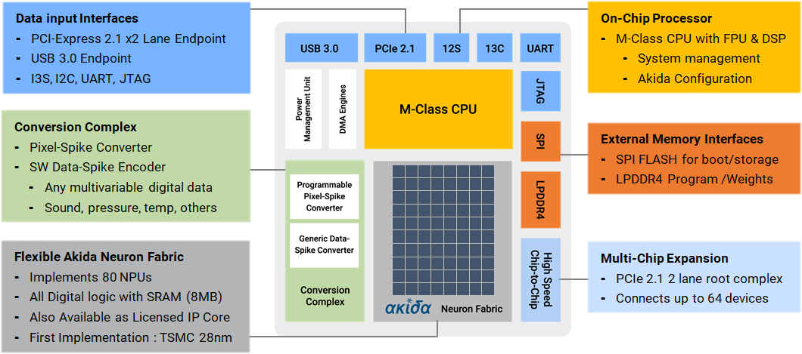
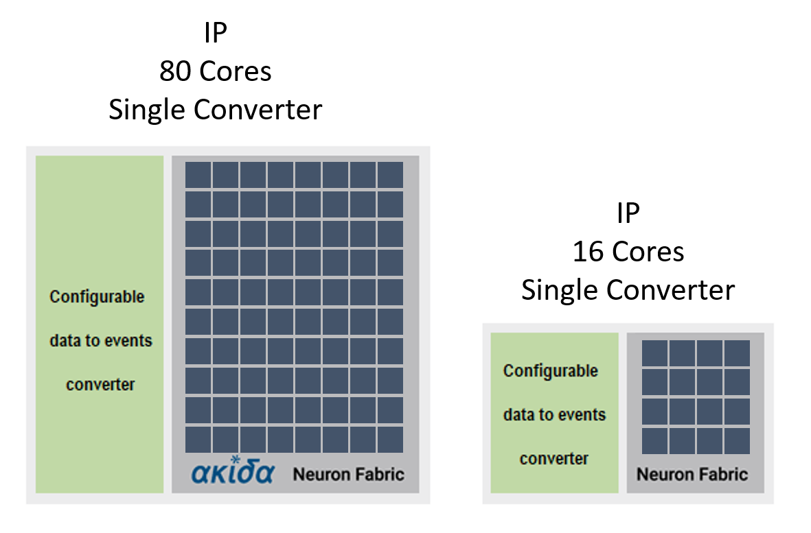
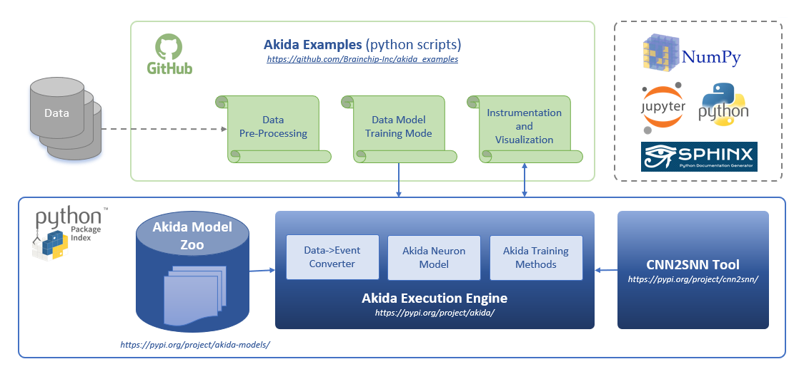
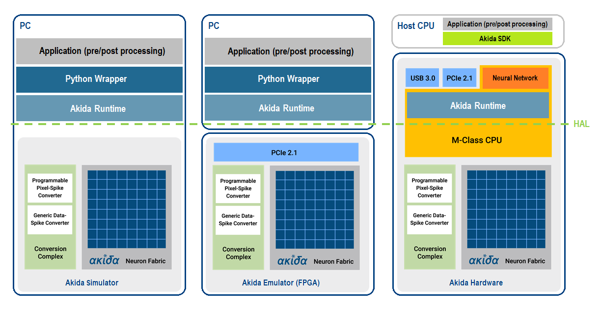

Overview
========

.. toctree::
   :hidden:
   :maxdepth: 2

   self
   Installation <installation.rst>
   User guide <user_guide/user_guide.rst>
   API reference <api_reference/api_reference.rst>
   Examples <examples/index.rst>
   Changelog <https://github.com/Brainchip-Inc/akida_examples/releases>
   Support <https://support.brainchip.com/portal/home>
   license.rst

The Akida Neural Processor
--------------------------

BrainChip's Akida integrated circuit technology is an ultra-low power, high
performance, minimum memory footprint, event domain neural processor targeting
Edge AI applications. In addition, because the architecture is based upon an
event domain processor, leveraging fundamental principles from biological SNNs,
the processor supports incremental learning. This allows a deeply trained
network to continue to learn new classifiers without requiring a re-training
process. Due to the highly optimized architecture, the Akida Neural Processor
eliminates the need for a CPU to run the neural network algorithm and in most
cases eliminates the need for a DRAM external to the neural fabric. The
elimination of external devices makes the Akida solution significantly more
power efficient compared to deep learning accelerators which require both
external CPU and memory.

Built around a mesh-connected array of neural processor units (NPUs) the
architecture is highly scalable to meet the needs of a wide range of
applications. The uniqueness of the BrainChip Akida Architecture lies in the
ability of the hardware to run traditional feedforward, deeply learned CNN
networks as well as native SNN networks. This documentation provides examples
of how to develop both classes of solutions, using industry standard tool flows
and networks, to solve a variety of application problems such as vision,
acoustic, cybersecurity amongst others.

The Akida neural processor is available both as Intellectual Property (IP)
circuit design for integration in ASIC products or as a System on a Chip (SoC)
product.

As *Figure 1* shows, the SoC is built around a core neural processor comprised
of 80 neural processing units, it includes a conversion complex and allows one
to run popular convolutional neural networks (CNNs) such as MobileNet [#fn-1]_.
Designers can use the Akida SoC to run industry standard CNNs, dramatically
reducing power by changing convolutions to event based computations, or run
native SNN solutions.

   Figure 1. BrainChip Akida processor

The Akida chip includes several key features that differentiate it from other
neural network processors and deep learning accelerators. These are:

* Event-based computing leveraging inherent data and activation sparsity
* Fully configurable neural processing cores, supporting convolutional,
  separable-convolutional, pooling and fully connected layers
* Incremental learning after off-line training
* On-chip few-shot training
* Configurable number of NPUs
* Programmable data to event converter
* Event-based NPU engines running on a single clock
* Configurable on-chip SRAM memory
* Runs full neural networks in hardware
* On chip communication via mesh network
* On chip learning in event domain
* Process technology independent platform
* Network size customizable to application needs
* IP deliverables include: RTL, dev tools, test suites and documentation

*Figure 2* shows several examples of IP configurations that could be envisioned.
Because the architecture is based upon a neural processing unit which is
arrayed and mesh connected, the number of NPUs per solution is dependent upon
the application need.

   Figure 2. Akida IP example configurations

The Akida Development Environment
---------------------------------

The Akida Development Environment (ADE) relies on a high-level neural networks
API, written in Python, and largely inspired by the `Keras API
<https://keras.io>`_.

The core data structure used by the Akida Execution Engine is a neural network
**model**\ , which itself is a linear stack of **layers**.

The ADE leverages the `TensorFlow <https://www.tensorflow.org/>`_ framework and
`PyPI <https://pypi.org/>`_ for BrainChip tools installation.
The major difference with other machine learning frameworks is that the data
exchanged between layers is not the usual **dense** multidimensional arrays,
but sets of spatially organized events that can be modelled as **sparse**
multidimensional arrays.

Throughout this documentation, those events will often be referred as "spikes",
due to their close similarity with the signals exchanged by biological neurons.

   Figure 3. Akida Development Environment

The Akida Development Environment comprises three main python packages:

* the `Akida Execution Engine <https://pypi.org/project/akida>`_ is an interface
  to the Brainchip Akida Neuromorphic System-on-Chip (NSoC). To allow the
  development of Akida models without an actual Akida hardware, it includes a
  runtime, an Hardware Abstraction Layer (HAL) and a software backend that
  simulates the Akida NSoC (see *Figure 4*\ ).

   Figure 4. Akida Execution Engine

* the `CNN2SNN tool <https://pypi.org/project/cnn2snn>`_ provides means to
  convert Convolutional Neural Networks (CNN) that were trained using Deep
  Learning methods to event domain, low-latency and low-power network for use
  with the Akida Execution Engine.

* the `Akida model zoo <https://pypi.org/project/akida-models>`_ contains
  pre-created network models built with the Akida sequential API and the
  CNN2SNN tool using quantized Keras models.

The Akida examples
------------------

The `examples section <examples/index.html>`_ comprises a zoo of event-based CNN
and SNN tutorials. One can check models performances against MNIST, CIFAR10,
ImageNet and Google Speech Commands (KWS) datasets.

.. note::
    | While the Akida examples are provided under an
      `Apache License 2.0 <https://www.apache.org/licenses/LICENSE-2.0.txt>`_,
      the underlying Akida library is proprietary.
    | Please refer to the `End User License Agreement <license.html>`__ for
      terms and conditions.

____

.. [#fn-1] In most cases the entire network can be accommodated using the
   on-chip SRAM.
   Even the large MobileNet network used to classify 1000 classes of ImageNet fits
   comfortably.
