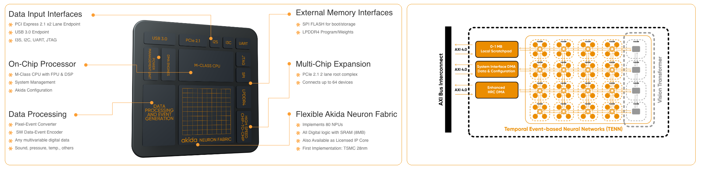
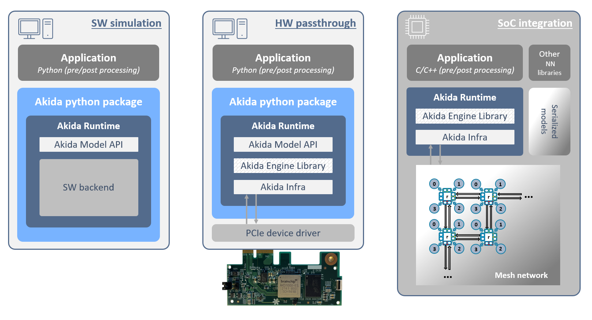

Overview
========

.. toctree::
   :hidden:
   :maxdepth: 2

   self
   Installation <installation.rst>
   User guide <user_guide/user_guide.rst>
   API reference <api_reference/api_reference.rst>
   Examples <examples/index.rst>
   Model zoo performance <model_zoo_performance.rst>
   Changelog <changelog.rst>
   Support <https://support.brainchip.com/portal/home>
   license.rst

The Akida Neuromorphic ML Framework
-----------------------------------

| The Akida Development Environment (MetaTF) is a complete machine learning
  framework enabling the seamless creation, training, and testing of neural
  networks on the Akida Neuromorphic Processor Platform. MetaTF includes an
  `Akida Neuromorphic Processor IP <https://brainchip.com/akida2-0//>`_
  simulator for execution of models in addition to Akida hardware implementations
  such as the `AKD1000 reference SoC <https://brainchip.com/akida-neural-processor-soc/>`_.
| Inspired by the `Keras API <https://keras.io>`_, MetaTF provides a high-level
  Python API for neural networks. This API facilitates early evaluation,
  design, final tuning, and productization of neural network models.

  AKD1000 reference SoC (left), Akida 2\ :sup:`nd` Generation IP (right)

|
|
| MetaTF is comprised of four Python packages which leverage the
  `TensorFlow <https://www.tensorflow.org/>`_ framework and are installed
  from the `PyPI <https://pypi.org/>`_ repository via `pip` command.
| The four MetaTF packages contain:

  * a Model zoo (`akida-models <https://pypi.org/project/akida-models>`_) to
    directly load quantized models or to easily instantiate and train Akida
    compatible models,

  * a quantization tool (`quantizeml <https://pypi.org/project/quantizeml>`_)
    for quantization of CNN, Transformer, and TENN models using low-bitwidth
    weights and outputs,

  * a conversion tool (`cnn2snn <https://pypi.org/project/cnn2snn>`_) to convert
    models to a binary format for model execution on an Akida platform,

  * and an interface to the Akida Neuromorphic Processor (`akida <https://pypi.org/project/akida>`_)
    including a runtime, a Hardware Abstraction Layer (HAL) and a software
    backend. It allows the simulation of the Akida Neuromorphic Processor and
    use of the AKD1000 reference SoC.

 .. figure:: img/metatf.png
   :target: _images/metatf.png
   :alt: Brainchip
   :scale: 40%
   :align: center

   Akida MetaTF ML Framework

|
|
| The Akida package introduced above allows one to simulate the Akida Neuromorphic
  Processor IP without the need for any hardware. Furthermore, the interface to the
  Akida runtime enables seamless integration with Python-based, machine learning
  frameworks for easy prototyping with the Akida Neuromorphic Processor IP.
| It includes:

  * the Akida model API - a library supporting the native development of Akida models,
    the inference of instantiated models, their serialization (program sequences)
    and their mapping for a targeted hardware device,

  * a simulator (software backend) - a CPU implementation of the Akida Neuromorphic
    Processor IP,

  * and the Akida Engine Library - a C++ library supporting the instantiation of model
    programs produced by the model library on actual hardware devices and inference on
    programmed devices.

   Akida runtime configurations

The Akida examples
------------------

The `examples section <examples/index.html>`_ includes tutorials and examples to easily
get started with Akida technology. This section illustrates the use of Akida technology
on a variety of inference and incremental, on-device learning applications.

.. warning::
    | While the Akida examples are provided under an
      `Apache License 2.0 <https://www.apache.org/licenses/LICENSE-2.0.txt>`_,
      the underlying Akida library is proprietary.
    | Please refer to the `End User License Agreement <license.html>`__ for
      terms and conditions.
