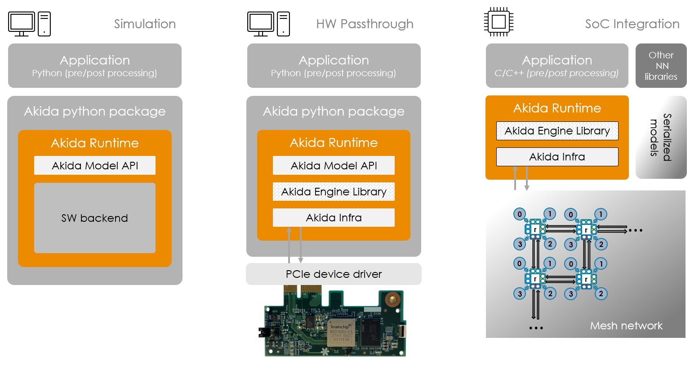

Overview
========

.. toctree::
   :hidden:
   :maxdepth: 2

   self
   Installation <installation.rst>
   User guide <user_guide/user_guide.rst>
   API reference <api_reference/api_reference.rst>
   Examples <examples/index.rst>
   Model zoo performances <zoo_performances.rst>
   Changelog <https://github.com/Brainchip-Inc/akida_examples/releases>
   Support <https://support.brainchip.com/portal/home>
   license.rst

The Akida Neuromorphic ML Framework
-----------------------------------

| The Akida Development Environment (MetaTF) is a complete machine learning
  framework that enables the seamless creation, training, and testing of neural
  networks running on the `Akida Neuromorphic Processor IP <https://brainchip.com/akida2-0//>`_
  simulator and the `AKD1000 reference SoC <https://brainchip.com/akida-neural-processor-soc/>`_.
| It relies on a high-level neural networks API, written in Python, and
  largely inspired by the `Keras API <https://keras.io>`_. It allows early
  evaluation and design, as well as final tuning and productization of networks.

.. figure:: img/Akida_Neural_Processor.png
  :target: _images/Akida_Neural_Processor.png
  :alt: Brainchip
  :scale: 40%
  :align: center

  AKD1000 reference SoC (left), Akida 2\ :sup:`nd` Generation IP (right)

|
|
| MetaTF leverages the `TensorFlow <https://www.tensorflow.org/>`_ framework
  and `PyPI <https://pypi.org/>`_ for the BrainChip tools installation.
| It comprises four python packages:

  * a Model zoo (`akida-models <https://pypi.org/project/akida-models>`_) to
    easily instantiate and train Akida compatible models or to load directly
    their quantized versions,

  * a quantization tool (`quantizeml <https://pypi.org/project/quantizeml>`_)
    that allows the quantization of CNN, Transformer and TENN models using
    low-bitwidth weights and outputs,

  * a conversion tool (`cnn2snn <https://pypi.org/project/cnn2snn>`_) that
    provides means to convert models that were trained and quantized,

  * an interface to the Akida Neuromorphic Processor (`akida <https://pypi.org/project/akida>`_)
    including a runtime, an Hardware Abstraction Layer (HAL) and software
    backend. It allows the simulation of Akida Neuromorphic Processor and use
    of the AKD1000 reference SoC.

 .. figure:: img/metatf.png
   :target: _images/metatf.png
   :alt: Brainchip
   :scale: 40%
   :align: center

   Akida MetaTF ML Framework

|
|
| The Akida python package can be used to simulate the Akida Neuromorphic Processor
  IP without the need of any hardware. It exposes the features provided by the Akida
  Runtime, allowing a seamless integration with python machine-learning frameworks
  for easy prototyping and testing of the Akida Neuromorphic Processor IP.
| It includes:

  * the Akida model API, a library supporting the native creation of Akida models,
    the inference of instantiated models, their serialization (program sequences)
    and their mapping for a targetted hardware device,

  * a SW backend (simulator),  CPU implementation of the Akida training and inference,

  * the Akida Engine Library, C++ library supporting the instantiation of model programs
    produced by the model library on actual hardware devices, the inference on
    programmed devices.

   Akida runtime configurations

The Akida examples
------------------

The `examples section <examples/index.html>`_ comprises several tutorials and
examples to get easily started with the Akida technology. One can check the
Akida incremental learning and inference in a wide variety of use cases.

.. warning::
    | While the Akida examples are provided under an
      `Apache License 2.0 <https://www.apache.org/licenses/LICENSE-2.0.txt>`_,
      the underlying Akida library is proprietary.
    | Please refer to the `End User License Agreement <license.html>`__ for
      terms and conditions.
