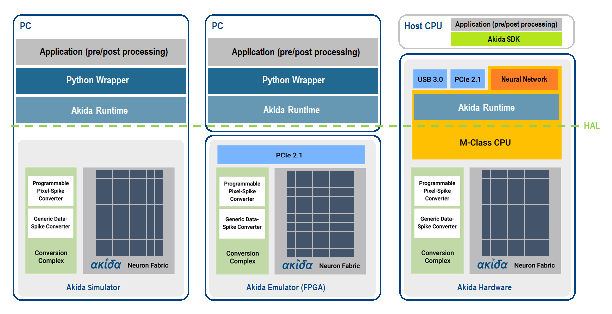

Overview
========

.. toctree::
   :hidden:
   :maxdepth: 2

   self
   Installation <installation.rst>
   User guide <user_guide/user_guide.rst>
   API reference <api_reference/api_reference.rst>
   Examples <examples/index.rst>
   Support <https://support.brainchip.com/portal/home>
   license.rst

The Akida processor
-------------------

The Akida chip is a unique design, optimized for low-power edge AI, that
emulates, in hardware, the functions of neurons and synapses. The device is
event-driven, and thus inherently sparse, producing fast inference at a low
power consumption.

Built around a mesh-connected array of 80 neural processor units (NPUs), as
*Figure 1* shows, the chip includes a conversion complex and allows to run
popular convolutional neural networks (CNNs) such as MobileNet [#fn-1]_.
Designers can use the Akida chip as a native SNN processor, or they can use the
BrainChip `CNN2SNN <user_guide/cnn2snn.html>`__ tool to retrain their CNNs,
reducing power by changing convolutions to event based computations.

.. figure:: img/Akida_Block_Diagram.png
   :target: _images/Akida_Block_Diagram.png
   :alt: Brainchip
   :align: center

   Figure 1. BrainChip Akida processor

The Akida chip includes a number of key features that differentiate it from
other neural networks and SNN implementations. These are:

* Synaptic modeling
* Event-based computing resulting in sparsity
* Highly configurable connectivity from one layer to the next
* Fully configurable neural processing cores, supporting convolutional,
  separable-convolutional, pooling and fully connected layers
* Incremental learning after off-line training
* On-chip few-shot training
* On-chip unsupervised learning

The Akida Execution Engine
--------------------------

The Akida Execution Engine `AEE <user_guide/aee.html>`__ is an interface
for the Akida processor. The AEE includes a python wrapper to access the Akida
Core API, the Akida Runtime, an Hardware Abstraction Layer (HAL) and the chip
simulator (see *Figure 2*\ ). It enables the creation, training, and running
inference of neural networks targeting the Akida chip.

   Figure 2. Akida Execution Engine

The Akida examples
------------------

The `examples section <examples/index.html>`_ comprises a zoo of event-based CNN
and SNN tutorials. One can check models performances against MNIST, CIFAR10,
ImageNet and Google Speech Commands (KWS) datasets.

.. note::
    While the Akida examples are provided under an
    `Apache License 2.0 <https://www.apache.org/licenses/LICENSE-2.0.txt>`_,
    the underlying AEE library is proprietary.

    Please refer to the `End User License Agreement <license.html>`__ for
    terms and conditions.

____

.. [#fn-1] In most cases the entire network can be accommodated using the
   on-chip SRAM.
   Even the large MobileNet network used to classify 1000 classes of ImageNet fits
   comfortably.
