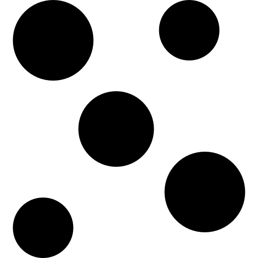

Model zoo performance
=====================

| The Brainchip `akida_models <https://pypi.org/project/akida-models>`__ package offers a set of pre-built
  Akida-compatible models (e.g. MobileNet, AkidaNet), pretrained weights for those models and training
  scripts. Please refer to the `model zoo API reference <./api_reference/akida_models_apis.html#model-zoo>`__
  for a complete list of the available models.

| This page lists the performance of all models from the zoo reported for Akida 1.0, Akida 2.0 and
  Akida Pico. Please refer to:

* `Akida 1.0 models`_ for models targeting the Akida Neuromorphic Processor IP 1.0 and the AKD1000 reference SoC,
* `Akida 2.0 models`_ for models targeting the Akida Neuromorphic Processor IP 2.0,
* `Akida Pico models`_ for models targeting the Akida Pico Neuromorphic Processor IP,
* `Upgrading to Akida 2.0 tutorial <./examples/quantization/plot_1_upgrading_to_2.0.html>`_ to understand the
  architectural differences between 1.0 and 2.0 models and their respective workflows.

.. note::
    The download links provided point towards standard TensorFlow Keras models
    that must be converted to an Akida model using
    `cnn2snn.convert <./api_reference/cnn2snn_apis.html#convert>`_.

Akida 1.0 models
----------------

For 1.0 models, 4-bit accuracy is provided and is always obtained through a QAT phase.

.. note::
    * The "8/4/4" quantization scheme stands for 8-bit weights in the input layer, 4-bit weights in
      other layers and 4-bit activations.
    * The NPs column provides the minimal number of neural processors required for the model
      execution on the Akida IP. The numbers given are the result of the
      `map <./api_reference/akida_apis.html#akida.Model.map>`_ operation using the
      `Minimal MapMode <./api_reference/akida_apis.html#akida.MapMode>`_ targeting AKD1000/AKD1500
      SoC.
    * Energy per inference is an average, measured on an AKD1500 device for the most efficient
      mapping.

|image_icon_ref| Image domain
~~~~~~~~~~~~~~~~~~~~~~~~~~~~~

Classification
""""""""""""""

+------------------+------------+--------------------+---------+--------------+----------------+-----------+-----+-------------+----------------+
| Architecture     | Resolution | Dataset            | #Params | Quantization | Top-1 accuracy | Size (KB) | NPs | Energy (mJ) | Download       |
+==================+============+====================+=========+==============+================+===========+=====+=============+================+
| AkidaNet 0.25    | 160        | ImageNet           | 480K    | 8/4/4        | 42.58%         | 403.3     | 20  | 1.56        | |an_160_25_dl| |
+------------------+------------+--------------------+---------+--------------+----------------+-----------+-----+-------------+----------------+
| AkidaNet 0.5     | 160        | ImageNet           | 1.4M    | 8/4/4        | 57.80%         | 1089.1    | 24  | 4.32        | |an_160_50_dl| |
+------------------+------------+--------------------+---------+--------------+----------------+-----------+-----+-------------+----------------+
| AkidaNet         | 160        | ImageNet           | 4.4M    | 8/4/4        | 66.94%         | 4061.1    | 68  | 13.66       | |an_160_dl|    |
+------------------+------------+--------------------+---------+--------------+----------------+-----------+-----+-------------+----------------+
| AkidaNet 0.25    | 224        | ImageNet           | 480K    | 8/4/4        | 46.71%         | 409.1     | 22  | 2.50        | |an_224_25_dl| |
+------------------+------------+--------------------+---------+--------------+----------------+-----------+-----+-------------+----------------+
| AkidaNet 0.5     | 224        | ImageNet           | 1.4M    | 8/4/4        | 61.30%         | 1202.2    | 32  | 6.885       | |an_224_50_dl| |
+------------------+------------+--------------------+---------+--------------+----------------+-----------+-----+-------------+----------------+
| AkidaNet         | 224        | ImageNet           | 4.4M    | 8/4/4        | 69.65%         | 6294.0    | 116 | 26.34       | |an_224_dl|    |
+------------------+------------+--------------------+---------+--------------+----------------+-----------+-----+-------------+----------------+
| AkidaNet 0.5     | 160        | ImageNet           | 4.0M    | 8/4/4        | 51.66%         | 2017.4    | 38  | 6.63        | |ane_160_dl|   |
| edge             |            |                    |         |              |                |           |     |             |                |
+------------------+------------+--------------------+---------+--------------+----------------+-----------+-----+-------------+----------------+
| AkidaNet 0.5     | 224        | ImageNet           | 4.0M    | 8/4/4        | 54.03%         | 2130.5    | 46  | 9.99        | |ane_224_dl|   |
| edge             |            |                    |         |              |                |           |     |             |                |
+------------------+------------+--------------------+---------+--------------+----------------+-----------+-----+-------------+----------------+
| AkidaNet 0.5     | 224        | PlantVillage       | 1.1M    | 8/4/4        | 97.92%         | 1019.1    | 33  | 7.17        | |an_pv_dl|     |
+------------------+------------+--------------------+---------+--------------+----------------+-----------+-----+-------------+----------------+
| AkidaNet 0.25    | 96         | Visual Wake Words  | 229K    | 8/4/4        | 84.77%         | 179.6     | 16  | 0.49        | |vww_dl|       |
+------------------+------------+--------------------+---------+--------------+----------------+-----------+-----+-------------+----------------+
| MobileNetV1 0.25 | 160        | ImageNet           | 467K    | 8/4/4        | 36.05%         | 376.4     | 20  | 1.53        | |mb_160_25_dl| |
+------------------+------------+--------------------+---------+--------------+----------------+-----------+-----+-------------+----------------+
| MobileNetV1 0.5  | 160        | ImageNet           | 1.3M    | 8/4/4        | 54.59%         | 1007.0    | 24  | 4.21        | |mb_160_50_dl| |
+------------------+------------+--------------------+---------+--------------+----------------+-----------+-----+-------------+----------------+
| MobileNetV1      | 160        | ImageNet           | 4.2M    | 8/4/4        | 65.47%         | 3525.8    | 65  | 13.44       | |mb_160_dl|    |
+------------------+------------+--------------------+---------+--------------+----------------+-----------+-----+-------------+----------------+
| MobileNetV1 0.25 | 224        | ImageNet           | 467K    | 8/4/4        | 39.73%         | 377.9     | 22  | 2.46        | |mb_224_25_dl| |
+------------------+------------+--------------------+---------+--------------+----------------+-----------+-----+-------------+----------------+
| MobileNetV1 0.5  | 224        | ImageNet           | 1.3M    | 8/4/4        | 58.50%         | 1065.3    | 32  | 6.68        | |mb_224_50_dl| |
+------------------+------------+--------------------+---------+--------------+----------------+-----------+-----+-------------+----------------+
| MobileNetV1      | 224        | ImageNet           | 4.2M    | 8/4/4        | 68.76%         | 5223.3    | 110 | 26.28       | |mb_224_dl|    |
+------------------+------------+--------------------+---------+--------------+----------------+-----------+-----+-------------+----------------+
| GXNOR            | 28         | MNIST              | 1.6M    | 2/2/1        | 98.03%         | 412.8     | 3   | 0.34        | |gx_dl|        |
+------------------+------------+--------------------+---------+--------------+----------------+-----------+-----+-------------+----------------+

Object detection
""""""""""""""""

+--------------+------------+--------------------------+---------+--------------+--------+-----------+-----+-------------+-------------+
| Architecture | Resolution | Dataset                  | #Params | Quantization | mAP    | Size (KB) | NPs | Energy (mJ) | Download    |
+==============+============+==========================+=========+==============+========+===========+=====+=============+=============+
| YOLOv2       | 224        | PASCAL-VOC 2007 -        | 3.6M    | 8/4/4        | 41.51% | 3061.4    | 71  | 14.61       | |yl_voc_dl| |
|              |            | person and car classes   |         |              |        |           |     |             |             |
+--------------+------------+--------------------------+---------+--------------+--------+-----------+-----+-------------+-------------+
| YOLOv2       | 224        | WIDER FACE               | 3.5M    | 8/4/4        | 77.63% | 3053.1    | 71  | 14.22       | |yl_wf_dl|  |
+--------------+------------+--------------------------+---------+--------------+--------+-----------+-----+-------------+-------------+

Regression
""""""""""

+--------------+------------+--------------------------+---------+--------------+--------+-----------+-----+-------------+----------+
| Architecture | Resolution | Dataset                  | #Params | Quantization | MAE    | Size (KB) | NPs | Energy (mJ) | Download |
+==============+============+==========================+=========+==============+========+===========+=====+=============+==========+
| VGG-like     | 32         | UTKFace (age estimation) | 458K    | 8/2/2        | 6.1791 | 138.6     | 6   | 0.14        | |reg_dl| |
+--------------+------------+--------------------------+---------+--------------+--------+-----------+-----+-------------+----------+

Face recognition
""""""""""""""""

+--------------+------------+----------------------+---------+--------------+----------+-----------+-----+-------------+-----------+
| Architecture | Resolution | Dataset              | #Params | Quantization | Accuracy | Size (KB) | NPs | Energy (mJ) | Download  |
+==============+============+======================+=========+==============+==========+===========+=====+=============+===========+
| AkidaNet 0.5 | 112×96     | CASIA Webface        | 2.3M    | 8/4/4        | 70.18%   | 1930.1    | 21  | 3.73        | |fid_dl|  |
|              |            | face identification  |         |              |          |           |     |             |           |
+--------------+------------+----------------------+---------+--------------+----------+-----------+-----+-------------+-----------+
| AkidaNet 0.5 | 112×96     | CASIA Webface        | 23.6M   | 8/4/4        | 71.13%   | 6980.2    | 34  | 8.41        | |fide_dl| |
| edge         |            | face identification  |         |              |          |           |     |             |           |
+--------------+------------+----------------------+---------+--------------+----------+-----------+-----+-------------+-----------+

|audio_icon_ref| Audio domain
~~~~~~~~~~~~~~~~~~~~~~~~~~~~~

Keyword spotting
""""""""""""""""

+--------------+-----------------------+---------+--------------+----------------+-----------+-----+-------------+----------+
| Architecture | Dataset               | #Params | Quantization | Top-1 accuracy | Size (KB) | NPs | Energy (mJ) | Download |
+==============+=======================+=========+==============+================+===========+=====+=============+==========+
| DS-CNN       | Google Speech Commands| 22.7K   | 8/4/4        | 91.72%         | 23.1      | 5   | 0.07        | |kws_dl| |
+--------------+-----------------------+---------+--------------+----------------+-----------+-----+-------------+----------+

|pointcloud_icon_ref| Point cloud
~~~~~~~~~~~~~~~~~~~~~~~~~~~~~~~~~

Classification
""""""""""""""

+--------------+--------------------+---------+--------------+--------------+-----------+-----+-----------+
| Architecture | Dataset            | #Params | Quantization | Accuracy     | Size (KB) | NPs | Download  |
+==============+====================+=========+==============+==============+===========+=====+===========+
| PointNet++   | ModelNet40         | 602K    | 8/4/4        | 79.78%       | 490.9     | 12  | |p++_dl|  |
|              | 3D Point Cloud     |         |              |              |           |     |           |
+--------------+--------------------+---------+--------------+--------------+-----------+-----+-----------+

Akida 2.0 models
----------------

For 2.0 models, both 8-bit PTQ and 4-bit QAT numbers are given. When not explicitly stated, 8-bit PTQ
accuracy is given as is (i.e. no further tuning/training, only quantization and calibration). The 4-bit
QAT is the same as for 1.0.

.. note::
    * The digit in the quantization scheme stands for both the weights and activations bitwidth.
      Weights in the first layer are always quantized to 8-bit.
    * The NPs column provides the minimal number of neural processors required for the model
      execution on the Akida IP. The numbers given are the result of the
      `map <./api_reference/akida_apis.html#akida.Model.map>`_ operation using the
      `Minimal MapMode <./api_reference/akida_apis.html#akida.MapMode>`_ targeting a `12-node
      <./api_reference/akida_apis.html#akida.TwelveNodesIPv2>`_ Akida 2.0 device.

|image_icon_ref| Image domain
~~~~~~~~~~~~~~~~~~~~~~~~~~~~~

Classification
""""""""""""""

+------------------+------------+--------------------+---------+--------------+----------+-----+------------------+
| Architecture     | Resolution | Dataset            | #Params | Quantization | Accuracy | NPs | Download         |
+==================+============+====================+=========+==============+==========+=====+==================+
| AkidaNet 0.25    | 160        | ImageNet           | 483K    | 8            | 48.61%   | 27  | |an_160_25_8_dl| |
|                  |            |                    |         |              |          |     |                  |
|                  |            |                    |         | 4            | 40.69%   | 26  | |an_160_25_4_dl| |
+------------------+------------+--------------------+---------+--------------+----------+-----+------------------+
| AkidaNet 0.5     | 160        | ImageNet           | 1.4M    | 8            | 61.92%   | 42  | |an_160_50_8_dl| |
|                  |            |                    |         |              |          |     |                  |
|                  |            |                    |         | 4            | 57.42%   | 29  | |an_160_50_4_dl| |
+------------------+------------+--------------------+---------+--------------+----------+-----+------------------+
| AkidaNet         | 160        | ImageNet           | 4.4M    | 8            | 69.96%   | 124 | |an_160_8_dl|    |
|                  |            |                    |         |              |          |     |                  |
|                  |            |                    |         | 4            | 66.80%   | 60  | |an_160_4_dl|    |
+------------------+------------+--------------------+---------+--------------+----------+-----+------------------+
| AkidaNet 0.25    | 224        | ImageNet           | 483K    | 8            | 52.38%   | 31  | |an_224_25_8_dl| |
|                  |            |                    |         |              |          |     |                  |
|                  |            |                    |         | 4            | 44.48%   | 26  | |an_224_25_4_dl| |
+------------------+------------+--------------------+---------+--------------+----------+-----+------------------+
| AkidaNet 0.5     | 224        | ImageNet           | 1.4M    | 8            | 64.85%   | 55  | |an_224_50_8_dl| |
|                  |            |                    |         |              |          |     |                  |
|                  |            |                    |         | 4            | 60.53%   | 34  | |an_224_50_4_dl| |
+------------------+------------+--------------------+---------+--------------+----------+-----+------------------+
| AkidaNet         | 224        | ImageNet           | 4.4M    | 8            | 72.23%   | 206 | |an_224_8_dl|    |
|                  |            |                    |         |              |          |     |                  |
|                  |            |                    |         | 4            | 69.21%   | 92  | |an_224_4_dl|    |
+------------------+------------+--------------------+---------+--------------+----------+-----+------------------+
| AkidaNet 0.5     | 224        | PlantVillage       | 1.2M    | 8            | 99.61%   | 56  | |an_pv8_dl|      |
|                  |            |                    |         |              |          |     |                  |
|                  |            |                    |         | 4            | 99.30%   | 35  | |an_pv4_dl|      |
+------------------+------------+--------------------+---------+--------------+----------+-----+------------------+
| AkidaNet 0.25    | 96         | Visual Wake Words  | 227K    | 8            | 87.05%   | 25  | |vww8_dl|        |
|                  |            |                    |         |              |          |     |                  |
|                  |            |                    |         | 4            | 85.70%   | 24  | |vww4_dl|        |
+------------------+------------+--------------------+---------+--------------+----------+-----+------------------+
| AkidaNet18       | 160        | ImageNet           | 2.4M    | 8            | 64.72%   | 61  | |an18_160_dl|    |
+------------------+------------+--------------------+---------+--------------+----------+-----+------------------+
| AkidaNet18       | 224        | ImageNet           | 2.4M    | 8            | 67.32%   | 86  | |an18_224_dl|    |
+------------------+------------+--------------------+---------+--------------+----------+-----+------------------+
| MobileNetV1 0.25 | 160        | ImageNet           | 469K    | 8            | 45.72%   | 31  | |mb_160_25_8_dl| |
|                  |            |                    |         |              |          |     |                  |
|                  |            |                    |         | 4            | 36.96%   | 30  | |mb_160_25_4_dl| |
+------------------+------------+--------------------+---------+--------------+----------+-----+------------------+
| MobileNetV1 0.5  | 160        | ImageNet           | 1.3M    | 8            | 60.16%   | 47  | |mb_160_50_8_dl| |
|                  |            |                    |         |              |          |     |                  |
|                  |            |                    |         | 4            | 54.09%   | 34  | |mb_160_50_4_dl| |
+------------------+------------+--------------------+---------+--------------+----------+-----+------------------+
| MobileNetV1      | 160        | ImageNet           | 4.2M    | 8            | 69.04%   | 114 | |mb_160_8_dl|    |
|                  |            |                    |         |              |          |     |                  |
|                  |            |                    |         | 4            | 64.92%   | 68  | |mb_160_4_dl|    |
+------------------+------------+--------------------+---------+--------------+----------+-----+------------------+
| MobileNetV1 0.25 | 224        | ImageNet           | 469K    | 8            | 49.58%   | 36  | |mb_224_25_8_dl| |
|                  |            |                    |         |              |          |     |                  |
|                  |            |                    |         | 4            | 40.80%   | 31  | |mb_224_25_4_dl| |
+------------------+------------+--------------------+---------+--------------+----------+-----+------------------+
| MobileNetV1 0.5  | 224        | ImageNet           | 1.3M    | 8            | 63.67%   | 65  | |mb_224_50_8_dl| |
|                  |            |                    |         |              |          |     |                  |
|                  |            |                    |         | 4            | 57.87%   | 44  | |mb_224_50_4_dl| |
+------------------+------------+--------------------+---------+--------------+----------+-----+------------------+
| MobileNetV1      | 224        | ImageNet           | 4.2M    | 8            | 71.31%   | 184 | |mb_224_8_dl|    |
|                  |            |                    |         |              |          |     |                  |
|                  |            |                    |         | 4            | 67.72%   | 106 | |mb_224_4_dl|    |
+------------------+------------+--------------------+---------+--------------+----------+-----+------------------+
| GXNOR            | 28         | MNIST              | 1.6M    | 4            | 98.57%   | 4   | |gx2_dl|         |
+------------------+------------+--------------------+---------+--------------+----------+-----+------------------+

Object detection
""""""""""""""""

+------------------------------------+------------+--------------------------+---------+--------------+----------+-----+------------------+
| Architecture                       | Resolution | Dataset                  | #Params | Quantization | mAP 50   | NPs | Download         |
+====================================+============+==========================+=========+==============+==========+=====+==================+
| YOLOv2 **(AkidaNet 0.5 backbone)** | 224        | PASCAL-VOC 2007          | 3.6M    | 8            | 51.41%   | 119 | |yl_voc8_dl|     |
|                                    |            |                          |         |              |          |     |                  |
|                                    |            |                          |         | 4            | 46.74%   | 70  | |yl_voc4_dl|     |
+------------------------------------+------------+--------------------------+---------+--------------+----------+-----+------------------+
| CenterNet **(AkidaNet18 backbone)**| 384        | PASCAL-VOC 2007          | 2.4M    | 8            | 72.77%   | 336 | |ce_voc_dl_384|  |
|                                    |            |                          |         |              | [#fn-2]_ |     |                  |
+------------------------------------+------------+--------------------------+---------+--------------+----------+-----+------------------+
| CenterNet **(AkidaNet18 backbone)**| 224        | PASCAL-VOC 2007          | 2.4M    | 8            | 66.08%   | 125 | |ce_voc_dl_224|  |
|                                    |            |                          |         |              | [#fn-2]_ |     |                  |
+------------------------------------+------------+--------------------------+---------+--------------+----------+-----+------------------+
| YOLOv2 **(AkidaNet 0.5 backbone)** | 224        | WIDER FACE               | 3.6M    | 8            | 80.51%   | 117 | |yl_wf8_dl|      |
|                                    |            |                          |         |              |          |     |                  |
|                                    |            |                          |         | 4            | 78.69%   | 69  | |yl_wf4_dl|      |
+------------------------------------+------------+--------------------------+---------+--------------+----------+-----+------------------+

.. [#fn-2] PTQ accuracy boosted with 1 epoch QAT.

Regression
""""""""""

+--------------+------------+--------------------------+---------+--------------+--------+-----+-----------+
| Architecture | Resolution | Dataset                  | #Params | Quantization | MAE    | NPs | Download  |
+==============+============+==========================+=========+==============+========+=====+===========+
| VGG-like     | 32         | UTKFace (age estimation) | 458K    | 8            | 6.0299 | 7   | |reg8_dl| |
|              |            |                          |         |              |        |     |           |
|              |            |                          |         | 4            | 6.1421 | 6   | |reg4_dl| |
+--------------+------------+--------------------------+---------+--------------+--------+-----+-----------+

Face recognition
""""""""""""""""

+--------------+------------+----------------------+---------+--------------+----------+-----+-----------+
| Architecture | Resolution | Dataset              | #Params | Quantization | Accuracy | NPs | Download  |
+==============+============+======================+=========+==============+==========+=====+===========+
| AkidaNet 0.5 | 112×96     | CASIA Webface        | 2.3M    | 8            | 73.02%   | 40  | |fid8_dl| |
|              |            | face identification  |         |              |          |     |           |
|              |            |                      |         | 4            | 68.60%   | 29  | |fid4_dl| |
+--------------+------------+----------------------+---------+--------------+----------+-----+-----------+

Segmentation
""""""""""""

+---------------+------------+-------------+---------+--------------+-----------------+-----+-----------+
| Architecture  | Resolution | Dataset     | #Params | Quantization | Binary IOU      | NPs | Download  |
+===============+============+=============+=========+==============+=================+=====+===========+
| AkidaUNet 0.5 | 128        | Portrait128 | 1.1M    | 8            | 0.9076 [#fn-3]_ | 66  | |unet_dl| |
+---------------+------------+-------------+---------+--------------+-----------------+-----+-----------+

.. [#fn-3] PTQ accuracy boosted with 1 epoch QAT.

|audio_icon_ref| Audio domain
~~~~~~~~~~~~~~~~~~~~~~~~~~~~~

Keyword spotting
""""""""""""""""

+--------------+-----------------------+---------+--------------+----------------+-----+------------+
| Architecture | Dataset               | #Params | Quantization | Top-1 accuracy | NPs | Download   |
+==============+=======================+=========+==============+================+=====+============+
| DS-CNN       | Google Speech Commands| 23.8K   | 8            | 92.83%         | 9   | |kws8_dl|  |
|              |                       |         |              |                |     |            |
|              |                       |         | 4            | 92.58%         | 9   | |kws4_dl|  |
+--------------+-----------------------+---------+--------------+----------------+-----+------------+

|pointcloud_icon_ref| Point cloud
~~~~~~~~~~~~~~~~~~~~~~~~~~~~~~~~~

Classification
""""""""""""""

+--------------+--------------------+---------+--------------+-----------------+-----+-----------+
| Architecture | Dataset            | #Params | Quantization | Accuracy        | NPs | Download  |
+==============+====================+=========+==============+=================+=====+===========+
| PointNet++   | ModelNet40         | 277K    | 8            | 79.62% [#fn-1]_ | 13  | |p++8_dl| |
|              | 3D Point Cloud     |         |              |                 |     |           |
|              |                    |         | 4            | 79.50%          | 11  | |p++4_dl| |
+--------------+--------------------+---------+--------------+-----------------+-----+-----------+

|tenns_icon_ref| TENNs
~~~~~~~~~~~~~~~~~~~~~~

Gesture recognition
"""""""""""""""""""

+--------------------+---------+--------------+----------+-----+-------------------+
| Dataset            | #Params | Quantization | Accuracy | NPs | Download          |
+====================+=========+==============+==========+=====+===================+
| DVS128             | 165K    | 8            | 97.12%   | 25  | |tenns_dvs_dl|    |
+--------------------+---------+--------------+----------+-----+-------------------+
| Jester             | 1.3M    | 8            | 95.04%   | 43  | |tenns_jester_dl| |
+--------------------+---------+--------------+----------+-----+-------------------+

Eye tracking
""""""""""""

+--------------------+---------+--------------+---------------------+-----+----------------+
| Dataset            | #Params | Quantization | Accuracy            | NPs | Download       |
+====================+=========+==============+=====================+=====+================+
| Eye tracking       | 219K    | 8            | p10: 98.58%         | 22  | |tenns_eye_dl| |
| CVPR 2024          |         |              |                     |     |                |
|                    |         |              | mean_distance: 2.17 |     |                |
+--------------------+---------+--------------+---------------------+-----+----------------+

.. [#fn-1] PTQ accuracy boosted with 5 epochs QAT.

Akida Pico models
-----------------

Pico models are recurrent TENNs targeting the Akida Pico Neuromorphic Processor IP. Please refer
to the `Recurrent TENNs API <./api_reference/akida_models_apis.html#recurrent-tenns>`__ for
model descriptions and to the `Akida Pico layers hardware constraints
<./user_guide/hardware/pico.html>`__ for mapping limits.

|audio_icon_ref| Audio domain
~~~~~~~~~~~~~~~~~~~~~~~~~~~~~

Keyword spotting
""""""""""""""""

+----------------+-----------------------+---------+--------------+----------+--------------+
| Architecture   | Dataset               | #Params | Quantization | Accuracy | Download     |
+================+=======================+=========+==============+==========+==============+
| TENN recurrent | Google Speech Commands| 46.6K   | 8            | 93.80%   | |tr_sc12_dl| |
+----------------+-----------------------+---------+--------------+----------+--------------+

Vibration domain
~~~~~~~~~~~~~~~~

Fault classification
""""""""""""""""""""

+----------------+-----------------------+---------+--------------+-----------+---------------+
| Architecture   | Dataset               | #Params | Quantization | Avg AUROC | Download      |
+================+=======================+=========+==============+===========+===============+
| TENN recurrent | UORED-VAFCLS          | 16.6K   | 8            | 0.9420    | |tr_uored_dl| |
+----------------+-----------------------+---------+--------------+-----------+---------------+
