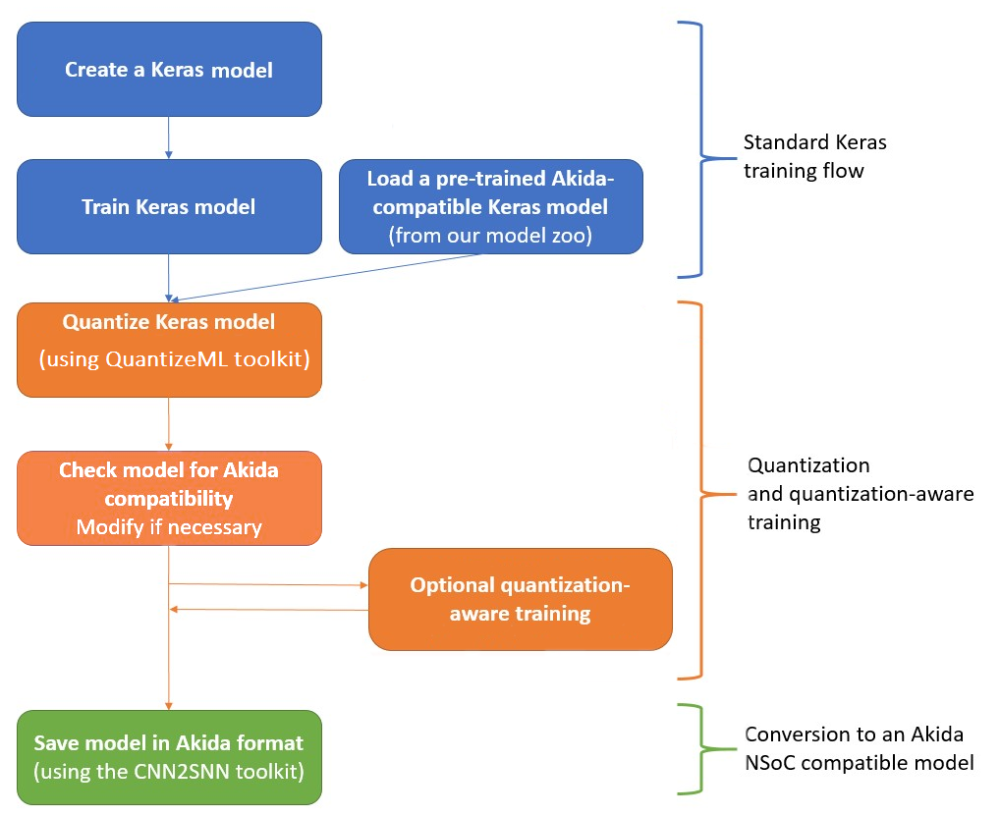

Akida user guide
================

Overview
--------

Like many other machine learning frameworks, the core data structures of Akida are layers and
models, and users familiar with Keras, Tensorflow or Pytorch should be on familiar grounds.

The main difference between Akida and other machine learning framework is that instead of modeling
traditional artificial neural networks, Akida models aim at representing `Spiking Neural Networks
<https://en.wikipedia.org/wiki/Spiking_neural_network>`__, i.e. interconnected graphs of neurons
that *fire* when their potential reaches a predefined *threshold*. Also, unlike other frameworks,
Akida layers only use integer arithmetics, inputs, outputs and weights.

Going from the standard deep learning world to Akida SNN world is done following simple steps:

- building a model using Keras or optionally using a model from `Brainchip zoo <akida_models.html>`__
- quantizing the model using the `QuantizeML toolkit <quantizeml.html>`__
- converting the model to Akida using the `CNN2SNN toolkit <cnn2snn.html>`__

   Akida workflow

A practical example of the overall flow is given in the examples section, see `GXNOR/MNIST example
<../examples/general/plot_0_gxnor_mnist.html#sphx-glr-examples-general-plot-0-gxnor-mnist-py>`__.

Programing interface
--------------------

The Akida Model
^^^^^^^^^^^^^^^

Similar to other deep learning frameworks, Akida offers a
`Model <../api_reference/akida_apis.html#model>`__ grouping layers into an object with inference
features.

The ``Model`` object has basic features such as:

- `summary() <../api_reference/akida_apis.html#akida.Model.summary>`__ method that prints a
  description of the model architecture.
- `save() <../api_reference/akida_apis.html#akida.Model.save>`__ method that needs a path for the
  model and that allows saving to disk for future use. The model will be saved as a file with an
  ``.fbz`` extension. A saved model can be reloaded using the ``Model`` object constructor with the
  full path of saved file as a string argument. This will automatically load the weights associated
  to the model.

  .. code-block:: python

      from akida import Model

      model.save("my_model.fbz")
      loaded_model = Model("my_model.fbz")
- `forward <../api_reference/akida_apis.html#akida.Model.forward>`__ method allows to infer the
  outputs of a specific set of inputs.

  .. code-block:: python

      import numpy as np

      # Prepare one sample
      input_shape = (1,) + tuple(model.input_shape)
      inputs = np.ones(input_shape, dtype=np.uint8)
      # Inference
      outputs = model.forward(inputs)
- `predict <../api_reference/akida_apis.html#akida.Model.predict>`__ method is very similar to the
  forward method, but is specifically designed to replicate the float outputs of a converted CNN.
- `statistics <../api_reference/akida_apis.html#akida.Model.statistics>`__ member provides relevant
  inference statistics.

Akida layers
^^^^^^^^^^^^

The sections below lists the available layers for Akida 1.0 and Akida 2.0. Those layers are obtained
from converting a quantized model to Akida and are thus automatically defined during conversion.
Akida layers only perform integer operations using 8bit or 4bit quantized inputs and weights.

Akida 1.0 layers
""""""""""""""""

- `InputData <../api_reference/akida_apis.html#akida.InputData>`__
- `InputConvolutional <../api_reference/akida_apis.html#akida.InputConvolutional>`__
- `FullyConnected <../api_reference/akida_apis.html#akida.FullyConnected>`__
- `Convolutional <../api_reference/akida_apis.html#akida.Convolutional>`__
- `SeparableConvolutional <../api_reference/akida_apis.html#akida.SeparableConvolutional>`__

Akida 2.0 layers
""""""""""""""""

- `InputConv2D <../api_reference/akida_apis.html#akida.InputConv2D>`__
- `Stem <../api_reference/akida_apis.html#akida.Stem>`__
- `Conv2D <../api_reference/akida_apis.html#akida.Conv2D>`__
- `Conv2DTranspose <../api_reference/akida_apis.html#akida.Conv2DTranspose>`__
- `Dense1D <../api_reference/akida_apis.html#akida.Dense1D>`__
- `Dense2D <../api_reference/akida_apis.html#akida.Dense2D>`__
- `DepthwiseConv2D <../api_reference/akida_apis.html#akida.DepthwiseConv2D>`__
- `DepthwiseConv2DTranspose <../api_reference/akida_apis.html#akida.DepthwiseConv2DTranspose>`__
- `Attention <../api_reference/akida_apis.html#akida.Attention>`__
- `Add <../api_reference/akida_apis.html#akida.Add>`__
- `Concatenate <../api_reference/akida_apis.html#akida.Concatenate>`__
- `ExtractToken <../api_reference/akida_apis.html#akida.ExtractToken>`__
- `BatchNormalization <../api_reference/akida_apis.html#akida.BatchNormalization>`__
- `MadNorm <../api_reference/akida_apis.html#akida.MadNorm>`__
- `Shiftmax <../api_reference/akida_apis.html#akida.Shiftmax>`__
- `Dequantizer <../api_reference/akida_apis.html#akida.Dequantizer>`__

Model Hardware Mapping
----------------------

By default, Akida models are implicitly mapped on a software backend: in other words, their
inference is computed on the host CPU.

Devices
^^^^^^^

In order to perform the inference of a model on hardware, the corresponding ``Model`` object must
first be mapped on a specific ``Device``.

The Akida ``Device`` object represents an Akida device, which is entirely characterized by:

- its `hardware version <../api_reference/akida_apis.html#hwversion>`__,
- the description of its `mesh <../api_reference/akida_apis.html#akida.NP.Mesh>`__ of
  processing nodes.

Discovering Hardware Devices
""""""""""""""""""""""""""""

The list of hardware devices detected on a specific host is available using the
`devices() <../api_reference/akida_apis.html#akida.devices>`__ method.

.. code-block:: python

    from akida import devices

    device = devices()[0]
    print(device.version)

It is also possible to list the available devices using a command:

.. code-block:: bash

    akida devices

Virtual Devices
"""""""""""""""

Most of the time, ``Device`` objects are real hardware devices, but virtual devices can also be
created to allow the mapping of a ``Model`` on a host that is not connected to a hardware device.

It is possible to build a virtual device for known hardware devices, by calling functions
`AKD1000() <../api_reference/akida_apis.html#akida.AKD1000>`__ and
`TwoNodesIP() <../api_reference/akida_apis.html#akida.TwoNodesIP>`__.

Model mapping
^^^^^^^^^^^^^

Mapping a model on a specific device is as simple as calling the ``Model``
`.map() <../api_reference/akida_apis.html#akida.Model.map>`__ method.

.. code-block:: python

    model.map(device)

When mapping a model on a device, if the Model contains layers that are not hardware compatible or
is too big to fit on the device, it will be split in multiple sequences.

The number of sequences, program size for each and how they are mapped are included in
the ``Model`` `.summary() <../api_reference/akida_apis.html#akida.Model.summary>`__ output after it
has been mapped on a device.

Advanced Mapping Details and Hardware Devices Usage
^^^^^^^^^^^^^^^^^^^^^^^^^^^^^^^^^^^^^^^^^^^^^^^^^^^

Calling ``Model`` `.map() <../api_reference/akida_apis.html#akida.Model.map>`__ might create more
than one "sequence". In this case, when inference methods are used, each sequence will be chain
loaded on the device to process the given input. Sequences can be obtained using the ``Model``
`.sequences() <../api_reference/akida_apis.html#akida.Model.sequences>`__ property, that will return
a list of sequence objects. The program used to load one sequence can be obtained programmatically.

.. code-block:: python

    model.map(device)
    print(len(model.sequences))
    # Assume there is at least one sequence.
    sequence = model.sequences[0]
    # Check program size
    print(len(sequence.program))

Once the model has been mapped, the sequences mapped in the Hardware run on the device,
and the sequences mapped in the Software run on the CPU.

One can also force the model to be mapped as one sequence in the hardware device
only by setting the parameter ``hw_only`` to True (by default the value is False).
See the `.map() <../api_reference/akida_apis.html#akida.Model.map>`__ method API for more details.

.. note::
  An exception will be raised if the Model cannot be mapped entirely on the device.

.. code-block:: python

  model.map(device, hw_only=True)

Once the model has been mapped, the inference happens only on the device, and not on the host
CPU except for passing inputs and fetching outputs.

Performances measurement
^^^^^^^^^^^^^^^^^^^^^^^^

It is possible to retrieve fps and power performances when inference happens on a device.

Enabling power measurement is simply done by:

.. code-block:: python

  device.soc.power_measurement_enabled = True

After sending data for inference and performances measurements can be retrieved
from the `model statistics <../api_reference/akida_apis.html#akida.Model.statistics>`__.

.. code-block:: python

  model_akida.forward(data)
  print(model_akida.statistics)

An example of power and fps performances is given in the `AkidaNet/ImageNet
tutorial <../examples/general/plot_1_akidanet_imagenet.html#hardware-mapping-and-performance>`__.

Using Akida Edge learning
-------------------------

Deep-learning SNN models are genuine CNN models converted to Akida SNN models.

As a consequence, deep-learning professionals do not need to learn any new framework to start using
Akida: they can simply craft their models in TensorFlow/Keras and convert them to Akida SNN models
using the `CNN2SNN <cnn2snn.html>`__ seamless conversion tool.

Unlike genuine CNN, deep-learning SNN cannot be trained online using back-propagation: for deep
models where online learning is required, it is therefore recommended to import the weights of early
layers from a pre-trained model, and to apply Akida Edge learning only on the last layer.

The Akida Edge learning is a unique feature of the Akida IP.

In this mode, an Akida Layer will typically be compiled with specific learning parameters and then
undergo a period of feed-forward unsupervised or semi-supervised training by letting it process
inputs generated by previous layers from a relevant dataset.

Once a layer has been compiled, new learning episodes can be resumed at any time, even after the
model has been saved and reloaded.

Learning constraints
^^^^^^^^^^^^^^^^^^^^

Only the last layer of a model can be trained with Akida Edge Learning and must fulfill the
following constraints:

* must be of type `FullyConnected <../api_reference/akida_apis.html#akida.FullyConnected>`__,
* must have binary weight,
* must receive binary inputs.

.. note::
    - a FullyConnected layer can only be added to a model defined using Akida 1.0 layers
    - it is only possible to obtain a FullyConnected layer from conversion when target version is
      set to `AkidaVersion.v1
      <../api_reference/cnn2snn_apis.html#cnn2snn.AkidaVersion.AkidaVersion.v1>`__

Compiling a layer
^^^^^^^^^^^^^^^^^

For a layer to learn using Akida Edge Learning, it must first be compiled using
the ``Model`` `.compile <../api_reference/akida_apis.html#akida.Model.compile>`_ method.

There is only one optimizer available for the compile method which is
`AkidaUnsupervised <../api_reference/akida_apis.html#akida.AkidaUnsupervised>`_ and it offers the
following learning parameters that can be specified when compiling a layer:

* ``num_weights``: integer value which defines the number of connections for
  each neuron and is constant across neurons. When determining a value for
  ``num_weights`` note that the total number of available connections for a
  `Convolutional <../api_reference/akida_apis.html#akida.Convolutional>`__
  layer is not set by the dimensions of the input to the layer, but by the
  dimensions of the kernel. Total connections = ``kernel_size`` x
  ``num_features``, where ``num_features`` is typically the ``filters`` or
  ``units`` of the preceding layer. ``num_weights`` should be much smaller
  than this value – not more than half, and often much less.
* [optional] ``num_classes``: integer value, representing the number of
  classes in the dataset. Defining this value sets the learning to a ‘labeled’
  mode, when the layer is initialized. The neurons are divided into groups of
  equal size, one for each input data class. When an input packet is sent with a
  label included, only the neurons corresponding to that input class are allowed
  to learn.
* [optional] ``initial_plasticity``: floating point value, range 0–1 inclusive
  (defaults to 1). It defines the initial plasticity of each neuron’s
  connections or how easily the weights will change when learning occurs;
  similar in some ways to a learning rate. Typically, this can be set to 1,
  especially if the model is initialized with random weights. Plasticity can
  only decrease over time, never increase; if set to 0 learning will never occur
  in the model.
* [optional] ``min_plasticity``: floating point value, range 0–1 inclusive
  (defaults to 0.1). It defines the minimum level to which plasticity will decay.
* [optional] ``plasticity_decay``: floating point value, range 0–1 inclusive
  (defaults to 0.25). It defines the decay of plasticity with each learning
  step, relative to the ``initial_plasticity``.
* [optional] ``learning_competition``: floating point value, range 0–1 inclusive
  (defaults to 0). It controls competition between neurons. This is a rather
  subtle parameter since there is always substantial competition in learning
  between neurons. This parameter controls the competition from neurons that
  have already learned – when set to zero, a neuron that has already learned a
  given feature will not prevent other neurons from learning similar features.
  As ``learning_competition`` increases such neurons will exert more
  competition. This parameter can, however, have serious unintended consequences
  for learning stability; we recommend that it should be kept low, and probably
  never exceed 0.5.

The only mandatory parameter is the number of active (non-zero) connections that
each of the layer neurons has with the previous layer, expressed as the number
of active ``weights`` for each neuron.

Optimizing this value is key to achieving high accuracy in the Akida NSoC.
Broadly speaking, the number of weights should be related to the number of
events expected to compose the items’ or item’s sub-features of interest.

Tips to set Akida learning parameters are detailed in `the dedicated example
<../examples/edge/plot_2_edge_learning_parameters.html>`_.
