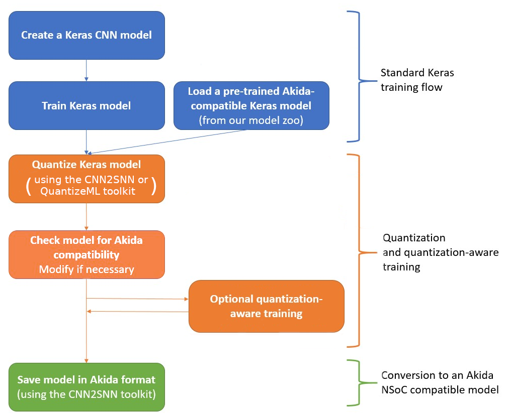

CNN2SNN toolkit
===============

Overview
--------

The Brainchip CNN2SNN toolkit provides means to convert Convolutional Neural
Networks (CNN) that were trained using Deep Learning methods to a low-latency
and low-power Spiking Neural Network (SNN) for use with the Akida Execution
Engine. This document is a guide to that process.

The Akida Execution Engine provides Spiking Neural Networks (SNN) in which
communications between neurons take the form of “spikes” or impulses that are
generated when a neuron exceeds a threshold level of activation. Neurons that
do not cross the threshold generate no output and contribute no further
computational cost downstream. This feature is key to Akida hardware efficiency.
The Akida Execution Engine further extends this efficiency by operating with low
bitwidth “synapses” or weights of connections between neurons.

Despite the apparent fundamental differences between SNNs and CNNs, the
underlying mathematical operations performed by each may be rendered identical.
Consequently, the trained parameters of a CNN can be converted to be
Akida-compatible, given only a small number of constraints. By careful
attention to specifics in the architecture and training of the CNN, an overly
complex conversion step from CNN to SNN can be avoided. The CNN2SNN toolkit
comprises a set of functions designed for the popular `Tensorflow Keras
<https://www.tensorflow.org/guide/keras>`_ framework, making it easy to train a
SNN-compatible network.

Conversion workflow
^^^^^^^^^^^^^^^^^^^

Typical training scenario
^^^^^^^^^^^^^^^^^^^^^^^^^

The first step in the conversion workflow is to train a standard Keras model.
This trained model is the starting point for the quantization stage. Once it is
established that the overall model configuration prior to quantization yields a
satisfactory performance on the task, we can proceed with quantization.

The CNN2SNN toolkit offers a turnkey solution to quantize a model:
the `quantize <../api_reference/cnn2snn_apis.html#quantize>`_ function. It
replaces the neural Keras layers (Conv2D, SeparableConv2D and Dense) and
the ReLU layers with custom CNN2SNN layers, which are quantization-aware
derived versions of the base Keras layer types. The obtained quantized model is
still a Keras model with a mix of CNN2SNN quantized layers (QuantizedReLU,
QuantizedDense, etc.) and standard Keras layers (BatchNormalization, MaxPool2D,
etc.).

Direct quantization of a standard Keras model (also called post-training
quantization) generally introduces a drop in performance. This drop is usually
small for 8-bit or even 4-bit quantization of simple models, but it can be very
significant for low quantization bitwidth and complex models.

If the quantized model offers acceptable performance, it can be directly
converted into an Akida model, ready to be loaded on the Akida NSoC (see the
`convert <../api_reference/cnn2snn_apis.html#convert>`_ function).

However, if the performance drop is too high, a quantization-aware training is
required to recover the performance prior to quantization. Since the quantized
model is a Keras model, it can then be trained using the standard Keras API.

Note that quantizing directly to the target bitwidth is not mandatory: it is
possible to proceed with quantization in a serie of smaller steps.
For example, it may be beneficial to keep float weights and only quantize
activations, retrain, and then, quantize weights.

Design compatibility constraints
^^^^^^^^^^^^^^^^^^^^^^^^^^^^^^^^

When designing a tf.keras model, consider design compatibility at these
distinct levels before the quantization stage:

* Only serial and feedforward arrangements can be converted\ [#fn-2]_.
* Supported Keras layers are listed `below <#supported-layer-types>`_.
* Order of the layers is important, e.g. a BatchNormalization layer
  must be placed before the activation, and not after.
* Some constraints are needed about layer's parameters, e.g. a MaxPool2D layer
  must have the same padding as its corresponding convolutional layer.

All these design compatibility constraints are summarized in the CNN2SNN
`check_model_compatibility <../api_reference/cnn2snn_apis.html#check-model-compatibility>`_
function. A good practice is to check model compatibility before going through
the training process [#fn-3]_.

Helpers (see `Layer Blocks
<../api_reference/akida_models_apis.html#layer-blocks>`_) are available in the
``akida_models`` PyPI package to easily create a compatible Keras model from
scratch.

Quantization compatibility constraints
^^^^^^^^^^^^^^^^^^^^^^^^^^^^^^^^^^^^^^

In addition to the model design constraints, the Akida NSoC has several
quantization constraints:

* Weights of the neural layers must be quantized using
  `1, 2, 3, 4 or 8 bits <hw_constraints.html>`_.
* Activations should be quantized too using 1, 2 or 4 bits, with maximum spike
  value set to 15\ [#fn-4]_\.
* Every neural layer accepts inputs with different quantization parameters,
  e.g. a quantized Dense layer can only accept 1-bit or 2-bit inputs.

Please refer to the `Hardware constraints <hw_constraints.html>`__ page for full
details.

Command-line interface
^^^^^^^^^^^^^^^^^^^^^^

In addition to the cnn2snn programming API, the CNN2SNN toolkit also provides a
command-line interface to perform quantization and conversion to an Akida NSoC
compatible model.

Quantizing a standard Keras model or a CNN2SNN quantized model using the CLI
makes use of the ``cnn2snn.quantize`` Python function. The same arguments, i.e.
the quantization bitwidths for weights and activations, are required.

**Examples**

Quantize a standard Keras model with 4-bit weights and activations and 8-bit
input weights:

.. code-block:: bash

    cnn2snn -m model_keras.h5 quantize -wq 4 -aq 4 -iq 8

The quantized model is automatically saved to ``model_keras_iq8_wq4_aq4.h5``.

Quantize an already quantized model with different quantization bitwidths:

.. code-block:: bash

    cnn2snn -m model_keras_iq8_wq4_aq4.h5 quantize -wq 2 -aq 2

A new quantized model named ``model_keras_iq2_wq2_aq2.h5`` is saved.

Converting a CNN2SNN quantized model into an Akida model using the CLI makes use
of the ``cnn2snn.convert`` Python function. The same arguments, i.e.
the input scaling and whether the inputs are sparse, are required.

**Examples**

Convert a quantized model without input scaling and with image inputs:

.. code-block:: bash

    cnn2snn -m model_keras_iq2_wq2_aq2.h5 convert

An Akida .fbz model named ``model_keras_iq2_wq2_aq2.fbz`` is then saved.

Convert a quantized model with input scaling of (255, 0) and with sparse inputs:

.. code-block:: bash

    cnn2snn -m model_keras_iq2_wq2_aq2.h5 convert -sc 255 -sh 0 -sp True

Layers Considerations
---------------------

Supported layer types
^^^^^^^^^^^^^^^^^^^^^

The CNN2SNN toolkit provides quantization of Keras models with the following
Keras layer types:

* **Core Neural Layers**\ :

  * tf.keras `Dense <https://www.tensorflow.org/api_docs/python/tf/keras/layers/Dense>`__
  * tf.keras `Conv2D <https://www.tensorflow.org/api_docs/python/tf/keras/layers/Conv2D>`__

* **Specialized Layers**\ :

  * tf.keras `SeparableConv2D <https://www.tensorflow.org/api_docs/python/tf/keras/layers/SeparableConv2D>`__

* **Other Layers (from tf.keras)**\ :

  * ReLU
  * BatchNormalization
  * MaxPooling2D
  * GlobalAveragePooling2D
  * Dropout
  * Flatten
  * Reshape
  * Input

CNN2SNN Quantization-aware layers
^^^^^^^^^^^^^^^^^^^^^^^^^^^^^^^^^

Several articles have reported\ [#fn-5]_ that the quantization of a pre-trained
float Keras model using 8-bit precision can be performed with a minimal loss
of accuracy for simple models, but that for lower bitwidth or complex models a
quantization-aware re-training of the quantized model may be required.

The CNN2SNN toolkit therefore includes quantization-aware versions of the base
Keras layers.

These layers are produced when quantizing a standard Keras model using the
``quantize`` function: it replaces the base Keras layers with their quantization-aware
counterparts (see the `quantize <../api_reference/cnn2snn_apis.html#quantize>`_ function).

Quantization-aware training simulates the effect of quantization in the forward
pass, yet using a straight-through estimator for the quantization gradient in
the backward pass.
For the stochastic gradient descent to be efficient, the weights are stored as
float values and updated with high precision during back propagation.
This ensures sufficient precision in accumulating tiny weights adjustments.

The CNN2SNN toolkit includes two classes of quantization-aware layers:

* **quantized processing layers**\ :

  * `QuantizedDense <../api_reference/cnn2snn_apis.html#quantizeddense>`__\ ,
  * `QuantizedConv2D <../api_reference/cnn2snn_apis.html#quantizedconv2d>`__\ ,
  * `QuantizedSeparableConv2D <../api_reference/cnn2snn_apis.html#quantizedseparableconv2d>`__

* **quantized activation layers**\ :

  * `QuantizedReLU <../api_reference/cnn2snn_apis.html#quantizedrelu>`_

Most of the parameters for the quantized processing layers are identical to
those used when defining a model using standard Keras layers. However, each of
these layers also includes a ``quantizer`` parameter that specifies the
`WeightQuantizer <../api_reference/cnn2snn_apis.html#weightquantizer>`_
object to use during the quantization-aware training.

The quantized ReLU takes a single parameter corresponding to the
bitwidth of the quantized activations.

Training-Only Layers
^^^^^^^^^^^^^^^^^^^^

The Akida Execution Engine is used in CNN conversion for inference only.
Training is done within the Keras environment and training-only layers may be
added at will, such as BatchNormalization or Dropout layers. These are handled
fully by Keras during the training and do not need to be modified to be
Akida-compatible for inference.

As regards the implementation within the Akida Execution Engine: it may be
helpful to understand that the associated scaling operations (multiplication and
shift) are never performed during inference. The computational cost is reduced
by wrapping the (optional) batch normalization function and quantized activation
function into the spike generating thresholds and other parameters of the Akida
SNN.
That process is completely transparent to the user. It does, however, have an
important consequence for the output of the final layer of the model; see
`Final Layers <#id6>`_ below.

First Layers
^^^^^^^^^^^^

Most layers of an Akida model only accept sparse inputs.
In order to support the most common classes of models in computer vision, a
special layer (`InputConvolutional <../api_reference/aee_apis.html#inputconvolutional>`__)
is however able to receive image data (8-bit grayscale or RGB). See the
`Akida user guide <aee.html>`__ for further details.

The CNN2SNN toolkit supports any quantization-aware training layer as the first
layer in the model. The type of input accepted by that layer can be specified
during conversion, but only models starting with a QuantizedConv2D layer will
accept dense inputs, thanks to the special `InputConvolutional <../api_reference/aee_apis.html#inputconvolutional>`__
layer.

Input Scaling
~~~~~~~~~~~~~~~

The `InputConvolutional <../api_reference/aee_apis.html#inputconvolutional>`_
layer only receives 8-bit input values:

* if the data is already in 8-bit format it can be sent to the Akida inputs
  without rescaling.
* if the data has been scaled to ease training, it is necessary to provide the
  scaling coefficients at model conversion.

This applies to the common case where input data are natively 8-bit. If input
data are not 8-bit, the process is more complex, and we recommend applying
rescaling in two steps:

#. Taking the data to an 8-bit unsigned integer format suitable for Akida
   architecture. Apply this step both for training and inference data.
#. Rescaling the 8-bit values to some unit or zero centered range suitable for
   CNN training, as above. This step should only be applied for the CNN training.
   Also, remember to provide those scaling coefficients when converting the
   trained model to an Akida-compatible format.

Final Layers
^^^^^^^^^^^^

As is typical for CNNs, the final layer of a model does not include the
standard activation nonlinearity. If that is the case, once converted to Akida
hardware, the model will give the potentials levels and in most cases, taking the
maximum among these values is sufficient to obtain the correct response from
the model.
However, if there is a difference in performance between the Keras and the
Akida-compatible implementations of the model, it is likely be at this step.

Tips and Tricks
---------------

In some cases, it may be useful to adapt existing CNN models in order to
simplify or enhance the converted SNN. Here's a short list of some possible
substitutions that might come in handy:

* `Substitute a fully connected layer with a convolutional layer
  <http://cs231n.github.io/convolutional-networks/#convert>`_.
* `Substitute a convolutional layer with stride 2 with a convolutional layer
  with stride 1 in combination with an additional pooling layer
  <https://arxiv.org/abs/1412.6806>`_.
* `Substitute a convolutional layer that has 1 large filter with multiple
  convolutional layers that contain smaller filters
  <http://cs231n.github.io/convolutional-networks/>`_.

____

.. [#fn-1] Sparsity refers to the fraction of both weights and activations with
           value zero.
.. [#fn-2] Parallel layers and "residual" connections are currently not
           supported.
.. [#fn-3] Check model compatibility must be applied on a quantized model. It
            then requires to quantize the model first.
.. [#fn-4] The spike value depends on the intensity of the potential, see the
           `Akida documentation <aee.html>`_ for details on the activation.
.. [#fn-5] See for instance `"Quantizing deep convolutional networks for
           efficient inference: A whitepaper"
           <https://arxiv.org/pdf/1806.08342.pdf>`_
           - Raghuraman Krishnamoorthi, 2018
