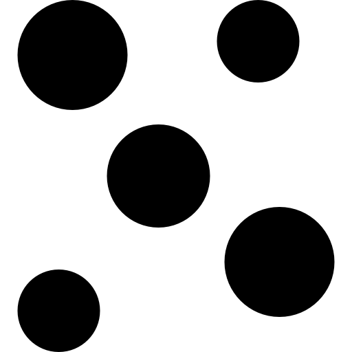

Model zoo performances
======================

This page lets you discover all of Akida model zoo machine learning models with
their respective performances.

.. note::
    The download links provided point towards standard Tensorflow Keras models
    that must be converted to Akida model using
    `cnn2snn.convert <api_reference/cnn2snn_apis.html#convert>`_.

.. |image_icon_ref| image:: ./img/image_icon.png
   :scale: 5 %

|image_icon_ref| Image domain
-----------------------------

Classification
~~~~~~~~~~~~~~

.. |an_ex| image:: ./img/link_icon.png
   :scale: 4 %
   :target: examples/general/plot_1_akidanet_imagenet.html

.. |an_160_25_dl| image:: ./img/download_icon.png
   :scale: 4 %
   :target: http://data.brainchip.com/models/akidanet/akidanet_imagenet_160_alpha_25_iq8_wq4_aq4.h5

.. |an_160_50_dl| image:: ./img/download_icon.png
   :scale: 4 %
   :target: http://data.brainchip.com/models/akidanet/akidanet_imagenet_160_alpha_50_iq8_wq4_aq4.h5

.. |an_160_dl| image:: ./img/download_icon.png
   :scale: 4 %
   :target: http://data.brainchip.com/models/akidanet/akidanet_imagenet_160_iq8_wq4_aq4.h5

.. |an_224_25_dl| image:: ./img/download_icon.png
   :scale: 4 %
   :target: http://data.brainchip.com/models/akidanet/akidanet_imagenet_224_alpha_25_iq8_wq4_aq4.h5

.. |an_224_50_dl| image:: ./img/download_icon.png
   :scale: 4 %
   :target: http://data.brainchip.com/models/akidanet/akidanet_imagenet_224_alpha_50_iq8_wq4_aq4.h5

.. |an_224_dl| image:: ./img/download_icon.png
   :scale: 4 %
   :target: http://data.brainchip.com/models/akidanet/akidanet_imagenet_224_iq8_wq4_aq4.h5

.. |mb_160_25_dl| image:: ./img/download_icon.png
   :scale: 4 %
   :target: http://data.brainchip.com/models/mobilenet/mobilenet_imagenet_160_alpha_25_iq8_wq4_aq4.h5

.. |mb_160_50_dl| image:: ./img/download_icon.png
   :scale: 4 %
   :target: http://data.brainchip.com/models/mobilenet/mobilenet_imagenet_160_alpha_50_iq8_wq4_aq4.h5

.. |mb_160_dl| image:: ./img/download_icon.png
   :scale: 4 %
   :target: http://data.brainchip.com/models/mobilenet/mobilenet_imagenet_160_iq8_wq4_aq4.h5

.. |mb_224_25_dl| image:: ./img/download_icon.png
   :scale: 4 %
   :target: http://data.brainchip.com/models/mobilenet/mobilenet_imagenet_224_alpha_25_iq8_wq4_aq4.h5

.. |mb_224_50_dl| image:: ./img/download_icon.png
   :scale: 4 %
   :target: http://data.brainchip.com/models/mobilenet/mobilenet_imagenet_224_alpha_50_iq8_wq4_aq4.h5

.. |mb_224_dl| image:: ./img/download_icon.png
   :scale: 4 %
   :target: http://data.brainchip.com/models/mobilenet/mobilenet_imagenet_224_iq8_wq4_aq4.h5

.. |ane_ex| image:: ./img/link_icon.png
   :scale: 4 %
   :target: examples/edge/plot_0_edge_learning_vision.html#

.. |ane_160_dl| image:: ./img/download_icon.png
   :scale: 4 %
   :target: http://data.brainchip.com/models/akidanet_edge/akidanet_imagenet_160_alpha_50_edge_iq8_wq4_aq4.h5

.. |ane_224_dl| image:: ./img/download_icon.png
   :scale: 4 %
   :target: http://data.brainchip.com/models/akidanet_edge/akidanet_imagenet_224_alpha_50_edge_iq8_wq4_aq4.h5

.. |mbe_160_dl| image:: ./img/download_icon.png
   :scale: 4 %
   :target: http://data.brainchip.com/models/mobilenet_edge/mobilenet_imagenet_160_alpha_50_edge_iq8_wq4_aq4.h5

.. |mbe_224_dl| image:: ./img/download_icon.png
   :scale: 4 %
   :target: http://data.brainchip.com/models/mobilenet_edge/mobilenet_imagenet_224_alpha_50_edge_iq8_wq4_aq4.h5

.. |vgg11_dl| image:: ./img/download_icon.png
   :scale: 4 %
   :target: http://data.brainchip.com/models/vgg/vgg11_imagenet_224_iq8_wq4_aq4.h5

.. |an_c10_dl| image:: ./img/download_icon.png
   :scale: 4 %
   :target: http://data.brainchip.com/models/akidanet/akidanet_cifar10_iq8_wq4_aq4.h5

.. |an_pv_ex| image:: ./img/link_icon.png
   :scale: 4 %
   :target: examples/general/plot_4_transfer_learning.html

.. |an_cvd_dl| image:: ./img/download_icon.png
   :scale: 4 %
   :target: http://data.brainchip.com/models/akidanet/akidanet_cats_vs_dogs_iq8_wq4_aq4.h5

.. |an_ite_25_dl| image:: ./img/download_icon.png
   :scale: 4 %
   :target: http://data.brainchip.com/models/akidanet/akidanet_imagenette_224_alpha_25_iq8_wq4_aq4.h5

.. |an_ite_50_dl| image:: ./img/download_icon.png
   :scale: 4 %
   :target: http://data.brainchip.com/models/akidanet/akidanet_imagenette_224_alpha_50_iq8_wq4_aq4.h5

.. |an_ite_dl| image:: ./img/download_icon.png
   :scale: 4 %
   :target: http://data.brainchip.com/models/akidanet/akidanet_imagenette_224_iq8_wq4_aq4.h5

.. |an_mel_del| image:: ./img/download_icon.png
   :scale: 4 %
   :target: http://data.brainchip.com/models/akidanet/akidanet_melanoma_iq8_wq4_aq4.h5

.. |an_odir_dl| image:: ./img/download_icon.png
   :scale: 4 %
   :target: http://data.brainchip.com/models/akidanet/akidanet_odir5k_iq8_wq4_aq4.h5

.. |an_oct_dl| image:: ./img/download_icon.png
   :scale: 4 %
   :target: http://data.brainchip.com/models/akidanet/akidanet_retinal_oct_iq8_wq4_aq4.h5

.. |gx_ex| image:: ./img/link_icon.png
   :scale: 4 %
   :target: examples/general/plot_0_gxnor_mnist.html

.. |gx_dl| image:: ./img/download_icon.png
   :scale: 4 %
   :target: http://data.brainchip.com/models/gxnor/gxnor_mnist_iq2_wq2_aq1.h5

.. |an_pv_dl| image:: ./img/download_icon.png
   :scale: 4 %
   :target: http://data.brainchip.com/models/akidanet/akidanet_plantvillage_iq8_wq4_aq4.h5

.. |vww_dl| image:: ./img/download_icon.png
   :scale: 4 %
   :target: http://data.brainchip.com/models/akidanet/akidanet_vww_iq8_wq4_aq4.h5

+------------------+------------+--------------------+--------------+----------------+-------------+-----------+-----+----------------+
| Architecture     | Resolution | Dataset            | Quantization | Top-1 accuracy | Example     | Size (KB) | NPs | Download       |
+==================+============+====================+==============+================+=============+===========+=====+================+
| AkidaNet 0.25    | 160        | ImageNet           | 8/4/4        | 42.58%         | |an_ex|     | 392.3     | 23  | |an_160_25_dl| |
+------------------+------------+--------------------+--------------+----------------+-------------+-----------+-----+----------------+
| AkidaNet 0.5     | 160        | ImageNet           | 8/4/4        | 57.80%         | |an_ex|     | 1099.4    | 30  | |an_160_50_dl| |
+------------------+------------+--------------------+--------------+----------------+-------------+-----------+-----+----------------+
| AkidaNet         | 160        | ImageNet           | 8/4/4        | 66.94%         | |an_ex|     | 4090.2    | 81  | |an_160_dl|    |
+------------------+------------+--------------------+--------------+----------------+-------------+-----------+-----+----------------+
| AkidaNet 0.25    | 224        | ImageNet           | 8/4/4        | 46.71%         | |an_ex|     | 398.1     | 25  | |an_224_25_dl| |
+------------------+------------+--------------------+--------------+----------------+-------------+-----------+-----+----------------+
| AkidaNet 0.5     | 224        | ImageNet           | 8/4/4        | 61.30%         | |an_ex|     | 1214.4    | 38  | |an_224_50_dl| |
+------------------+------------+--------------------+--------------+----------------+-------------+-----------+-----+----------------+
| AkidaNet         | 224        | ImageNet           | 8/4/4        | 69.65%         | |an_ex|     | 6322.6    | 129 | |an_224_dl|    |
+------------------+------------+--------------------+--------------+----------------+-------------+-----------+-----+----------------+
| AkidaNet 0.5     | 160        | ImageNet           | 8/4/4        | 51.66%         | |ane_ex|    | 2017.1    | 38  | |ane_160_dl|   |
| edge             |            |                    |              |                |             |           |     |                |
+------------------+------------+--------------------+--------------+----------------+-------------+-----------+-----+----------------+
| AkidaNet 0.5     | 224        | ImageNet           | 8/4/4        | 54.03%         | |ane_ex|    | 2130.1    | 46  | |ane_224_dl|   |
| edge             |            |                    |              |                |             |           |     |                |
+------------------+------------+--------------------+--------------+----------------+-------------+-----------+-----+----------------+
| AkidaNet 0.5     | 160        | Cats vs dogs       | 8/4/4        | 96.60%         |             | 698.4     | 24  | |an_cvd_dl|    |
+------------------+------------+--------------------+--------------+----------------+-------------+-----------+-----+----------------+
| AkidaNet 0.25    | 224        | Imagenette         | 8/4/4        | 91.54%         |             | 203.9     | 22  | |an_ite_25_dl| |
+------------------+------------+--------------------+--------------+----------------+-------------+-----------+-----+----------------+
| AkidaNet 0.5     | 224        | Imagenette         | 8/4/4        | 95.67%         |             | 815.5     | 32  | |an_ite_50_dl| |
+------------------+------------+--------------------+--------------+----------------+-------------+-----------+-----+----------------+
| AkidaNet         | 224        | Imagenette         | 8/4/4        | 97.58%         |             | 5544.2    | 116 | |an_ite_dl|    |
+------------------+------------+--------------------+--------------+----------------+-------------+-----------+-----+----------------+
| AkidaNet 0.5     | 224        | SIIM-ISIC Melanoma | 8/4/4        | 98.31% -       |             | 811.4     | 32  | |an_mel_del|   |
|                  |            | Classification     |              | AUROC 0.7969   |             |           |     |                |
+------------------+------------+--------------------+--------------+----------------+-------------+-----------+-----+----------------+
| AkidaNet 0.5     | 224        | ODIR-5K Ocular     | 8/4/4        | 92.42% -       |             | 811.4     | 32  | |an_odir_dl|   |
|                  |            | disease recognition|              | AUROC 0.9847   |             |           |     |                |
+------------------+------------+--------------------+--------------+----------------+-------------+-----------+-----+----------------+
| AkidaNet 0.5     | 224        | Retinal OCT ocular | 8/4/4        | 81.10% -       |             | 811.4     | 32  | |an_oct_dl|    |
|                  |            | disease recognition|              | AUROC 0.9662   |             |           |     |                |
+------------------+------------+--------------------+--------------+----------------+-------------+-----------+-----+----------------+
| AkidaNet 0.5     | 224        | PlantVillage       | 8/4/4        | 97.92%         | |an_pv_ex|  | 1018.8    | 33  | |an_pv_dl|     |
+------------------+------------+--------------------+--------------+----------------+-------------+-----------+-----+----------------+
| AkidaNet 0.5     | 224        | CIFAR10            | 8/4/4        | 92.89%         |             | 829.3     | 33  | |an_c10_dl|    |
+------------------+------------+--------------------+--------------+----------------+-------------+-----------+-----+----------------+
| AkidaNet 0.25    | 96         | Visual Wake Words  | 8/4/4        | 82.75%         |             | 227.7     | 17  | |vww_dl|       |
+------------------+------------+--------------------+--------------+----------------+-------------+-----------+-----+----------------+
| MobileNetV1 0.25 | 160        | ImageNet           | 8/4/4        | 40.86%         |             | 365.4     | 23  | |mb_160_25_dl| |
+------------------+------------+--------------------+--------------+----------------+-------------+-----------+-----+----------------+
| MobileNetV1 0.5  | 160        | ImageNet           | 8/4/4        | 55.94%         |             | 1017.1    | 30  | |mb_160_50_dl| |
+------------------+------------+--------------------+--------------+----------------+-------------+-----------+-----+----------------+
| MobileNetV1      | 160        | ImageNet           | 8/4/4        | 66.40%         |             | 3554.5    | 78  | |mb_160_dl|    |
+------------------+------------+--------------------+--------------+----------------+-------------+-----------+-----+----------------+
| MobileNetV1 0.25 | 224        | ImageNet           | 8/4/4        | 45.12%         |             | 366.9     | 25  | |mb_224_25_dl| |
+------------------+------------+--------------------+--------------+----------------+-------------+-----------+-----+----------------+
| MobileNetV1 0.5  | 224        | ImageNet           | 8/4/4        | 59.76%         |             | 1075.4    | 38  | |mb_224_50_dl| |
+------------------+------------+--------------------+--------------+----------------+-------------+-----------+-----+----------------+
| MobileNetV1      | 224        | ImageNet           | 8/4/4        | 69.53%         |             | 5251.8    | 123 | |mb_224_dl|    |
+------------------+------------+--------------------+--------------+----------------+-------------+-----------+-----+----------------+
| MobileNetV1 0.5  | 160        | ImageNet           | 8/4/4        | 49.69%         |             | 1935.1    | 38  | |mbe_160_dl|   |
| edge             |            |                    |              |                |             |           |     |                |
+------------------+------------+--------------------+--------------+----------------+-------------+-----------+-----+----------------+
| MobileNetV1 0.5  | 224        | ImageNet           | 8/4/4        | 51.83%         |             | 1993.4    | 46  | |mbe_224_dl|   |
| edge             |            |                    |              |                |             |           |     |                |
+------------------+------------+--------------------+--------------+----------------+-------------+-----------+-----+----------------+
| VGG11            | 224        | ImageNet           | 8/4/4        | 52.22%         |             | 34825.2   | 21  | |vgg11_dl|     |
+------------------+------------+--------------------+--------------+----------------+-------------+-----------+-----+----------------+
| GXNOR            | 28         | MNIST              | 2/2/1        | 99.20%         | |gx_ex|     | 412.6     | 3   | |gx_dl|        |
+------------------+------------+--------------------+--------------+----------------+-------------+-----------+-----+----------------+

Object detection
~~~~~~~~~~~~~~~~

.. |yl_voc_ex| image:: ./img/link_icon.png
   :scale: 4 %
   :target: examples/general/plot_5_voc_yolo_detection.html

.. |yl_voc_dl| image:: ./img/download_icon.png
   :scale: 4 %
   :target: http://data.brainchip.com/models/yolo/yolo_akidanet_voc_iq8_wq4_aq4.h5

.. |yl_wf_dl| image:: ./img/download_icon.png
   :scale: 4 %
   :target: http://data.brainchip.com/models/yolo/yolo_akidanet_widerface_iq8_wq4_aq4.h5

+--------------+------------+--------------------------+--------------+--------+-------------+-----------+-----+-------------+
| Architecture | Resolution | Dataset                  | Quantization | mAP    | Example     | Size (KB) | NPs | Download    |
+==============+============+==========================+==============+========+=============+===========+=====+=============+
| YOLOv2       | 224        | PASCAL-VOC 2007 -        | 8/4/4        | 38.85% | |yl_voc_ex| | 3061.0    | 71  | |yl_voc_dl| |
|              |            | person and car classes   |              |        |             |           |     |             |
+--------------+------------+--------------------------+--------------+--------+-------------+-----------+-----+-------------+
| YOLOv2       | 224        | WIDER FACE               | 8/4/4        | 73.81% |             | 3052.7    | 71  | |yl_wf_dl|  |
+--------------+------------+--------------------------+--------------+--------+-------------+-----------+-----+-------------+

Regression
~~~~~~~~~~

.. |reg_ex| image:: ./img/link_icon.png
   :scale: 4 %
   :target: examples/general/plot_3_regression.html

.. |reg_dl| image:: ./img/download_icon.png
   :scale: 4 %
   :target: http://data.brainchip.com/models/vgg/vgg_utk_face_iq8_wq2_aq2.h5

+--------------+------------+--------------------------+--------------+--------+----------+-----------+-----+----------+
| Architecture | Resolution | Dataset                  | Quantization | MAE    | Example  | Size (KB) | NPs | Download |
+==============+============+==========================+==============+========+==========+===========+=====+==========+
| VGG-like     | 32         | UTKFace (age estimation) | 8/2/2        | 6.1791 | |reg_ex| | 139.8     | 6   | |reg_dl| |
+--------------+------------+--------------------------+--------------+--------+----------+-----------+-----+----------+

Face recognition
~~~~~~~~~~~~~~~~

.. |fid_dl| image:: ./img/download_icon.png
   :scale: 4 %
   :target: http://data.brainchip.com/models/akidanet/akidanet_faceidentification_iq8_wq4_aq4.h5

.. |fide_dl| image:: ./img/download_icon.png
   :scale: 4 %
   :target: http://data.brainchip.com/models/akidanet_edge/akidanet_faceidentification_edge_iq8_wq4_aq4.h5

.. |fver_dl| image:: ./img/download_icon.png
   :scale: 4 %
   :target: http://data.brainchip.com/models/akidanet/akidanet_faceverification_iq8_wq4_aq4.h5

+--------------+------------+----------------------+--------------+----------+-----------+-----+-----------+
| Architecture | Resolution | Dataset              | Quantization | Accuracy | Size (KB) | NPs | Download  |
+==============+============+======================+==============+==========+===========+=====+===========+
| AkidaNet 0.5 | 112x96     | CASIA Webface        | 8/4/4        | 70.18%   | 1929.8    | 21  | |fid_dl|  |
|              |            | face identification  |              |          |           |     |           |
+--------------+------------+----------------------+--------------+----------+-----------+-----+-----------+
| AkidaNet 0.5 | 112x96     | CASIA Webface        | 8/4/4        | 71.13%   | 6979.6    | 35  | |fide_dl| |
| edge         |            | face identification  |              |          |           |     |           |
+--------------+------------+----------------------+--------------+----------+-----------+-----+-----------+
| AkidaNet 0.5 | 112x96     | LFW                  | 8/4/4        | 97.25%   | 691.2     | 20  | |fver_dl| |
|              |            | face verification    |              |          |           |     |           |
+--------------+------------+----------------------+--------------+----------+-----------+-----+-----------+

.. |audio_icon_ref| image:: ./img/headphones_icon.png
   :scale: 5 %

|audio_icon_ref| Audio domain
-----------------------------

Keyword spotting
~~~~~~~~~~~~~~~~

.. |kws_ex| image:: ./img/link_icon.png
   :scale: 4 %
   :target: examples/general/plot_2_ds_cnn_kws.html

.. |kws_dl| image:: ./img/download_icon.png
   :scale: 4 %
   :target: http://data.brainchip.com/models/ds_cnn/ds_cnn_kws_iq8_wq4_aq4_laq1.h5

+--------------+-----------------------+--------------+----------------+----------+-----------+-----+----------+
| Architecture | Dataset               | Quantization | Top-1 accuracy | Example  | Size (KB) | NPs | Download |
+==============+=======================+==============+================+==========+===========+=====+==========+
| DS-CNN       | Google speech command | 8/4/4        | 91.34%         | |kws_ex| | 22.8      | 5   | |kws_dl| |
+--------------+-----------------------+--------------+----------------+----------+-----------+-----+----------+

.. |time_icon_ref| image:: ./img/time_icon.png
   :scale: 5 %

|time_icon_ref| Time domain
---------------------------

Fault detection
~~~~~~~~~~~~~~~

.. |cwru_dl| image:: ./img/download_icon.png
   :scale: 4 %
   :target: http://data.brainchip.com/models/convtiny/convtiny_cwru_iq8_wq2_aq4.h5

+--------------+--------------------------+--------------+----------+-----------+-----+-----------+
| Architecture | Dataset                  | Quantization | Accuracy | Size (KB) | NPs | Download  |
+==============+==========================+==============+==========+===========+=====+===========+
| Convtiny     | CWRU Electric Motor Ball | 8/2/4        | 99.3%    | 25.3      | 3   | |cwru_dl| |
|              | Bearing Fault Diagnosis  |              |          |           |     |           |
+--------------+--------------------------+--------------+----------+-----------+-----+-----------+

Classification
~~~~~~~~~~~~~~

.. |ecg_dl| image:: ./img/download_icon.png
   :scale: 4 %
   :target: http://data.brainchip.com/models/akidanet/akidanet_ecg_iq8_wq4_aq4.h5

+--------------+------------+--------------------+--------------+--------------+-----------+-----+-----------+
| Architecture | Resolution | Dataset            | Quantization | Accuracy     | Size (KB) | NPs | Download  |
+==============+============+====================+==============+==============+===========+=====+===========+
| AkidaNet 0.5 | 224        | Physionet2017      | 8/4/4        | 73.50% -     | 1008.4    | 36  | |ecg_dl|  |
|              |            | ECG classification |              | AUROC 0.7940 |           |     |           |
+--------------+------------+--------------------+--------------+--------------+-----------+-----+-----------+

|pointcloud_icon_ref| Point cloud
---------------------------------

Classification
~~~~~~~~~~~~~~

.. |p++_dl| image:: ./img/download_icon.png
   :scale: 4 %
   :target: http://data.brainchip.com/models/pointnet_plus/pointnet_plus_modelnet40_iq8_wq4_aq4.h5

+--------------+--------------------+--------------+--------------+---------------+-----------+-----+-----------+
| Architecture | Dataset            | Quantization | Accuracy     | Input scaling | Size (KB) | NPs | Download  |
+==============+====================+==============+==============+===============+===========+=====+===========+
| PointNet++   | ModelNet40         | 8/4/4        | 84.76%       | (127, 127)    | 528.5     | 17  | |p++_dl|  |
|              | 3D Point Cloud     |              |              |               |           |     |           |
+--------------+--------------------+--------------+--------------+---------------+-----------+-----+-----------+
